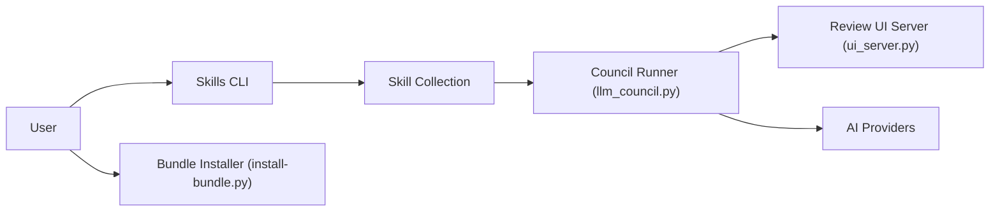

# am-will/codex-skills

> Collection de skills, agents et hooks pour Codex et autres agents de code, installable via `npx skills`.

## Le problème
Réutiliser planification, accès à la documentation et automatisation de navigateur entre agents demande de recopier des instructions à la main.

## Ce que ça fait vraiment
Dépôt de skills : `planner`, `plan-harder`, `parallel-task` (sous-agents en parallèle), `llm-council` (plusieurs planificateurs Claude/Codex/Gemini jugés par un agent, avec interface web), documentation (Context7, OpenAI docs, gitmcp.io), builder de prompts GPT-5.6, design frontend, deux outils de navigateur. Contient aussi 51 bundles de hooks Codex et des agents TOML spécialisés.

## Comment c'est branché


## Essayer
```bash
npx skills add am-will/codex-skills --list
npx skills add am-will/codex-skills --skill planner -g
python3 hooks/aitmpl-codex/install-bundle.py hooks/aitmpl-codex/<category>/<bundle> <target-repo>
```

## Coût et pièges
`ctx7old` exige `CONTEXT7_API_KEY`, `gemini-computer-use` exige `GEMINI_API_KEY`, `llm-council` demande des clés ou abonnements Anthropic, OpenAI et Google. Aucune licence déclarée, alors que certains skills sont importés d'Anthropic et de Vercel.

## Ce que ce n'est pas
Ce n'est pas un framework : c'est un catalogue de fichiers de prompts et de configuration. La qualité de chaque skill n'est pas évaluée dans le README.

## Alternatives
Aucune alternative nommée dans le README.

## Pour toi
À surveiller : pioche utile pour `planner` ou `parallel-task`, mais l'absence de licence interdit juridiquement de les réutiliser sans accord de l'auteur.

