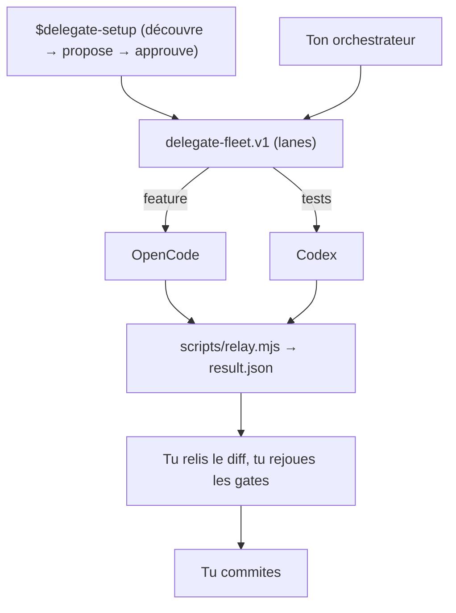

# amElnagdy/delegate-skills

> Un orchestrateur délègue à dix-sept CLI de code différents ; toi tu relis et tu commites.

## Le problème
Chaque CLI d'implémentation a ses propres drapeaux d'autonomie, son mode plan, sa reprise de
session : déléguer une tâche à l'un puis à l'autre demande de tout réapprendre.

## Ce que ça fait vraiment
Fournit un skill `*-delegate` par CLI (Aider, Antigravity, Claude Code, Cline, Codex, Command
Code, Cursor Agent, Grok Build, Kimi, OpenCode, Pi, Oh My Pi, Qoder, Mistral Vibe, Copilot
CLI, Warp `oz`, ZCode) plus un skill `delegate-setup` qui découvre les CLI installés et
propose une « flotte » de voies nommées (`feature`, `tests`, `ui`), écrite seulement après
approbation explicite. Chaque relais parle le même contrat `delegate-relay.result.v1` :
`status`, `exitCode`, `signal`, rapport final, `touchedFiles`, identifiant de session. Le
tableau central documente, CLI par CLI, l'accès en écriture par défaut, l'exécution en lecture
seule et la reprise — avec les cas où le CLI ne peut rien garantir.

## Comment c'est branché


## Essayer
```bash
npx skills add amElnagdy/delegate-skills
npx skills add amElnagdy/delegate-skills --list
npx skills add amElnagdy/delegate-skills --skill delegate-setup
npx skills add amElnagdy/delegate-skills --skill codex-delegate --agent claude-code
npx skills add amElnagdy/delegate-skills --global
```

## Coût et pièges
Gratuit ; Node 18+, `git`, et chaque CLI d'implémentation authentifié comme au terminal (donc
ses propres abonnements). Les notes de bas de page sont l'essentiel : Command Code n'a que
deux états, `-p` sans écriture ou `--yolo` sans limite de chemin ; Grok ne peut pas être
empêché d'écrire, le relais ne fait que signaler ; Aider commite par défaut, y compris tes
modifications non validées, et le relais force `--no-auto-commits`/`--no-dirty-commits` ;
ZCode n'a pas de binaire sur le PATH. `touchedFiles` est un `git status` d'après-coup, pas une
garantie : il ne voit ni les fichiers ignorés ni les écritures hors dépôt.

## Ce que ce n'est pas
Ce n'est pas un transmetteur : la boucle est dispatch → attente → relecture → commit, et le
relais ne commite **jamais**. Ce n'est pas un wrapper d'API — un vrai CLI édite un vrai
répertoire de travail. Aucun relais n'a de dépendance, de réseau propre, d'identifiants ou de
télémétrie : uniquement des primitives Node.

## Alternatives
- Les sous-agents ou plugins internes d'un éditeur, qui coordonnent dans un seul agent au lieu
  de garder le contrat portable entre orchestrateurs.

## Pour toi
Intéressant si tu veux faire tourner plusieurs CLI payants en parallèle sans céder le commit.
