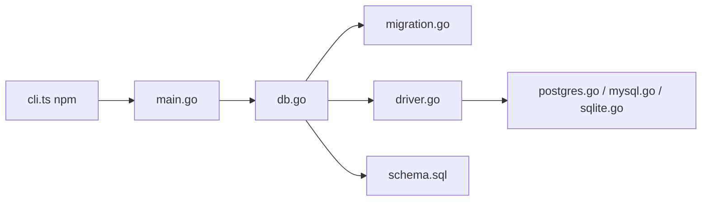

# amacneil/dbmate

> Outil en ligne de commande de migrations SQL indépendant du langage, pour équipes multi-services.

## Le problème
Garder le schéma d'une base synchronisé entre développeurs et production, surtout quand plusieurs services utilisent des langages différents.

## Ce que ça fait vraiment
Un binaire unique applique des migrations SQL horodatées, chacune dans une transaction. Il crée ou supprime des bases, annule la dernière migration, attend que la base soit disponible et écrit un fichier `schema.sql` à versionner. Supporte MySQL, MariaDB, PostgreSQL, SQLite et ClickHouse ; le README documente aussi BigQuery et Spanner (PostgreSQL). Utilisable en bibliothèque Go.

## Comment c'est branché


## Essayer
```bash
npm install --save-dev dbmate
npx dbmate --help
dbmate new create_users_table
dbmate up
dbmate rollback
dbmate status
```

## Coût et pièges
Gratuit. Le dump du schéma exige `pg_dump`, `mysqldump` ou `sqlite3` dans le PATH, sinon l'étape est ignorée sans bruit. Avec Postgres, `sslmode=disable` est souvent nécessaire en local.

## Ce que ce n'est pas
Pas un ORM ni un générateur de migrations : on écrit le SQL. Il n'empêche pas d'appliquer des migrations dans le désordre si elles arrivent de branches différentes.

## Alternatives
- goose, sql-migrate, golang-migrate, flyway, sqitch : comparés dans le tableau du README.

## Pour toi
À adopter pour versionner les schémas de tes bases d'appui (features, métadonnées ML) : un binaire, du SQL simple, pas de dépendance à un langage.

