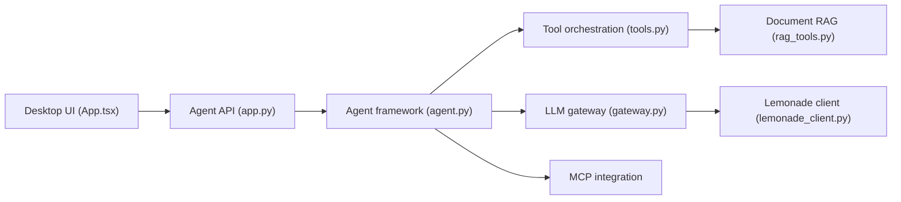

# amd/gaia

> Framework AMD pour construire des agents IA qui tournent en local sur matériel Ryzen AI, pour développeurs.

## Le problème
Faire tourner des agents (RAG, voix, vision) sans envoyer ses données au cloud ni payer d'inférence, sur du matériel grand public.

## Ce que ça fait vraiment
Classe de base `Agent` avec enregistrement d'outils (`@tool`), mémoire, RAG documentaire (50+ formats), voix (Whisper + Kokoro), vision (Qwen3-VL-4B), client MCP, système de plugins et registre d'agents. L'inférence passe par le serveur Lemonade ; des fournisseurs cloud (Fireworks AI, AMD LLM Gateway) sont optionnels. Un portage C++17 existe dans `cpp/`.

## Comment c'est branché


## Essayer
```bash
pip install amd-gaia
```
```python
from gaia.agents.base.agent import Agent
from gaia.agents.base.tools import tool
```
Le README renvoie au guide de démarrage pour Lemonade Server.

## Coût et pièges
Gratuit en local. Minimum : processeur AMD Ryzen AI série 300, 16 Go de RAM (64 Go recommandés), Windows 11 ou Linux. Le chat cloud envoie l'historique au fournisseur choisi. 1 072 issues ouvertes.

## Ce que ce n'est pas
Pas une solution portable : l'accélération NPU/iGPU vise le matériel AMD Ryzen AI. La mention « HIPAA-compliant » est une affirmation du README, non vérifiée ici.

## Alternatives
Aucune alternative nommée dans le README.

## Pour toi
À surveiller : intéressant si tu as une machine Ryzen AI et veux des agents 100 % locaux ; sinon l'intérêt tombe, le cœur de valeur étant lié à ce matériel.

