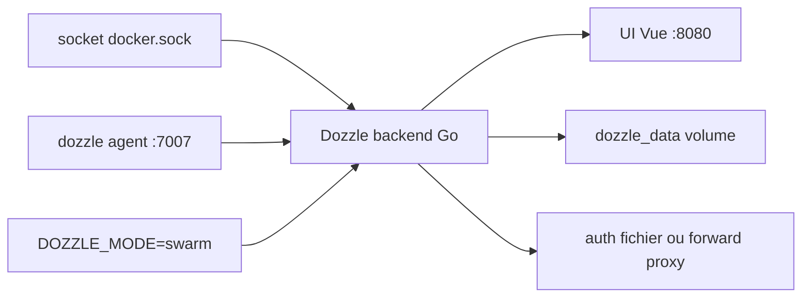

# amir20/dozzle

> Visualiseur web des logs Docker en direct, sans stockage ni indexation.

## Le problème
Suivre les logs de plusieurs conteneurs en direct demande autant de terminaux que de
`docker logs -f`, et déployer une pile Loki ou ELK pour ça est disproportionné.

## Ce que ça fait vraiment
Se branche sur le socket Docker et affiche les logs en temps réel dans le navigateur.
Recherche floue sur les noms de conteneurs, recherche dans les logs par regex ou par
requêtes SQL, écran scindé pour suivre plusieurs logs, statistiques mémoire et CPU en
direct, mode sombre. Authentification multi-utilisateurs avec support d'un proxy
d'autorisation en amont (Authelia). Mode Swarm en service global, et mode agent pour
surveiller plusieurs hôtes Docker depuis une seule interface. Négociation automatique
de version d'API : fonctionne avec Colima et Podman.

## Comment c'est branché


## Essayer
```bash
docker pull amir20/dozzle:latest
docker run --name dozzle -d --volume=/var/run/docker.sock:/var/run/docker.sock -v dozzle_data:/data -p 8080:8080 amir20/dozzle:latest
docker run -v /var/run/docker.sock:/var/run/docker.sock -p 7007:7007 amir20/dozzle:latest agent
```

## Coût et pièges
Gratuit, image d'environ 7 Mo compressée, construite `FROM scratch` donc sans shell —
les variantes `alpine` existent pour les cas qui montent un wrapper `#!/bin/sh` sur
l'entrypoint. Docker Engine 19.03 minimum (API 1.40+). Monter le socket Docker donne
un accès très large au démon : à ne pas exposer sans authentification. Analytics
anonymes envoyées à Google Analytics, désactivables par `--no-analytics`. Éviter
`latest` et `master` en production, préférer un tag exact.

## Ce que ce n'est pas
Pas un système de log centralisé : rien n'est stocké, et le README le dit — pas de
recherche hors ligne, Loggly, Papertrail ou Kibana sont plus adaptés pour une vraie
recherche. Testé avec des centaines de conteneurs, pas au-delà.

## Alternatives
- `dtop` : application type top pour les conteneurs, du même auteur, se lie à Dozzle.
- Loggly, Papertrail, Kibana : pour la recherche complète et l'historique.

## Pour toi
À installer sur toute machine Docker de travail : cinq minutes, 7 Mo, et on arrête
d'ouvrir des terminaux pour lire des logs.
