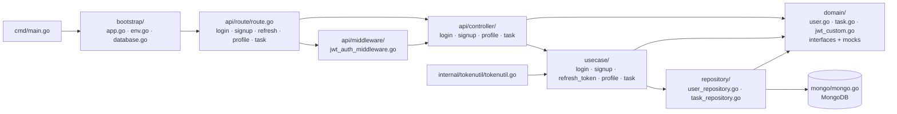

# amitshekhariitbhu/go-backend-clean-architecture

> **A layered Go backend skeleton, cloned as the starting point of an API project.**

## The problem

Starting an API in Go raises the same questions before the first line of business logic: where
routes belong, how to isolate database access, where to plug token validation, how to keep the
business layer testable without a real database. Everyone answers differently, and the
arbitration is replayed on every project. The author writes that he went through more than
twenty Go clean-architecture projects on GitHub before writing this one, and combined their
choices into it.

## What it actually does

The repository is a complete project, not a library: you clone it and build on top. It splits
the code into the five layers announced in the README — Router, Controller, Usecase,
Repository, Domain — and ships a real implementation of each across two functional domains:
authentication (signup, login, refresh token, profile) and a demonstration business resource
(task).

The assembled building blocks are named in the README: **gin** for the HTTP server, the
official Go **MongoDB** driver for persistence, **jwt** for access and refresh tokens,
**viper** to load configuration from a `.env` file, **bcrypt** for passwords, **testify** and
**mockery** for tests and mocks.

Two request flows are documented separately: a public API without middleware, and a private
API where a JWT authentication middleware validates the access token before the controller is
reached. The repository contains tests (`profile_controller_test.go`,
`user_repository_test.go`, `task_usecase_test.go`) and the mock regeneration procedure. Five
blog posts by the author, on outcomeschool.com, detail the architecture, the JWT middleware,
viper and testing; a Postman collection publishes the API documentation.

## How it is wired



No code-derived diagram exists for this repository: this one is rebuilt from the README alone,
using the full folder tree it publishes. The structuring point is `domain/`: layers do not know
each other directly, they talk through the interfaces declared there — which is exactly what
`mockery --dir=domain` exploits to generate the test doubles.

## Trying it

```bash
# Move to your workspace
cd your-workspace

# Clone this project into your workspace
git clone https://github.com/amitshekhariitbhu/go-backend-clean-architecture.git

# Move to the project root directory
cd go-backend-clean-architecture
```

Without Docker, the README asks you to create a `.env` modelled on `.env.example`, install Go
and MongoDB, set `DB_HOST=localhost` in the `.env`, then run `go run cmd/main.go` and call the
API at `http://localhost:8080`. With Docker, keep `DB_HOST=mongodb` and run
`docker-compose up -d`.

```bash
# Run all tests
go test ./...

# Generate mock code for the usecase and repository
mockery --dir=domain --output=domain/mocks --outpkg=mocks --all

# Generate mock code for the database
mockery --dir=mongo --output=mongo/mocks --outpkg=mocks --all
```

```bash
curl --location --request POST 'http://localhost:8080/signup' \
--data-urlencode 'email=test@gmail.com' \
--data-urlencode 'password=test' \
--data-urlencode 'name=Test Name'

curl --location --request GET 'http://localhost:8080/profile' \
--header 'Authorization: Bearer access_token'
```

## Cost and pitfalls

- **Nothing to pay**: Apache-2.0 licence, open source dependencies, no billed third-party
  service. The cost is in ramp-up time, not money.
- **MongoDB is imposed**: the repository layer is written for the official Go MongoDB driver.
  Moving to PostgreSQL is not a configuration option, it is a rewrite of `repository/` and
  `mongo/`.
- **The configuration pitfall is named by the README itself**: `DB_HOST=localhost` outside
  Docker, `DB_HOST=mongodb` with Docker. It is the first startup error.
- **Mocks are generated, not kept alive by hand**: any change to an interface in `domain/` or
  `mongo/` requires re-running the matching `mockery` command, otherwise tests compile against
  stale doubles.
- **Single-author repository**, tied to the author's training business (Outcome School). The
  README's TODO section is limited to "improvement based on feedback", "more test cases" and
  "update package versions": there is no roadmap.
- **The README is largely promotional**: a sizeable share of the text points to social media,
  paid programs and a system-design YouTube playlist, unrelated to the code.

## What it is not

- **It is not a dependency.** You do not add it to a `go.mod`: you clone the repository and its
  code becomes yours, upstream updates not included. No versioning, no stable API.
- **It is not a project generator**: no scaffolding CLI, no parameterised template. Renaming the
  module, removing the demonstration `task` domain and cleaning out the examples are manual work.
- **It is not a backend ready to serve**: the sample requests use `password=test`, the responses
  show placeholder tokens, and the README documents neither migrations, structured logging,
  observability, rate limiting nor deployment hardening. The `docker-compose.yaml` is a local
  development tool.
- **It is not a course on clean architecture**: the README lists the layers but defers the
  explanations to external blog posts. The code is the documentation.

## Alternatives

| | When to prefer it |
|---|---|
| **techschool/simplebank** | The genuinely comparable neighbour in the catalogue: also a complete pedagogical Go backend, but on PostgreSQL and backed by a video series. Prefer it if the relational database, migrations and gRPC matter more than layer separation around MongoDB. |

The other proposed neighbours (`pterodactyl/wings`, `drakkan/sftpgo`, `aquasecurity/trivy`) are
not comparable: they are finished Go programs run in production — a game daemon, an SFTP
server, a vulnerability scanner — not project skeletons to clone. The proximity comes from the
language alone. The README itself names no competing project: it only cites the packages used
and its author's articles.

## For you

Indirect interest for a data / AI / MLOps profile: this is not a tool you adopt, it is a wiring
diagram you read. If you have to expose a model or a pipeline behind a Go API with JWT
authentication, this repository shows in an afternoon where to put each piece and how to keep
the business layer testable without a database — the `domain/` + `mockery` discipline transfers
as is. Skip it if your stack is Python: FastAPI covers the same ground without learning Go, and
the cost of taking over a skeleton maintained by a single person then exceeds the gain.
