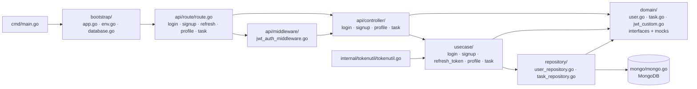

# amitshekhariitbhu/go-backend-clean-architecture

> **Un squelette de backend Go en couches, à cloner comme point de départ d'un projet d'API.**

## Le problème

Démarrer une API en Go pose toujours les mêmes questions avant la première ligne de métier :
où mettre les routes, comment isoler l'accès base, où brancher la validation du jeton, comment
rendre la couche métier testable sans base réelle. Chacun tranche différemment, et l'arbitrage
se rejoue à chaque projet. L'auteur écrit avoir parcouru plus de vingt projets Go « clean
architecture » sur GitHub avant d'écrire celui-ci, et d'en avoir combiné les partis pris.

## Ce que ça fait vraiment

Le dépôt est un projet complet, pas une bibliothèque : on le clone et on construit dessus.
Il découpe le code en cinq couches annoncées dans le README — Router, Controller, Usecase,
Repository, Domain — et livre pour chacune une implémentation réelle sur deux domaines
fonctionnels : l'authentification (signup, login, refresh token, profile) et une ressource
métier de démonstration (task).

Les briques assemblées sont nommées dans le README : **gin** pour le serveur HTTP, le driver
Go officiel **MongoDB** pour la persistance, **jwt** pour les jetons d'accès et de
rafraîchissement, **viper** pour charger la configuration depuis un fichier `.env`, **bcrypt**
pour les mots de passe, **testify** et **mockery** pour les tests et les bouchons.

Deux flux de requête sont documentés séparément : une API publique sans middleware, et une API
privée où un middleware d'authentification JWT valide le jeton d'accès avant d'atteindre le
contrôleur. Le dépôt contient des tests (`profile_controller_test.go`, `user_repository_test.go`,
`task_usecase_test.go`) et la procédure de régénération des mocks. Cinq billets de blog de
l'auteur, sur outcomeschool.com, détaillent l'architecture, le middleware JWT, viper, et les
tests ; une collection Postman publie la documentation d'API.

## Comment c'est branché



Aucun diagramme tiré du code n'existe pour ce dépôt : ce schéma est reconstruit depuis le seul
README, à partir de l'arborescence complète qu'il publie. Le point structurant est `domain/` :
les couches ne se connaissent pas directement, elles se parlent par les interfaces déclarées là,
ce qui est précisément ce que `mockery --dir=domain` exploite pour générer les bouchons de test.

## Essayer

```bash
# Move to your workspace
cd your-workspace

# Clone this project into your workspace
git clone https://github.com/amitshekhariitbhu/go-backend-clean-architecture.git

# Move to the project root directory
cd go-backend-clean-architecture
```

Sans Docker, le README demande de créer un `.env` sur le modèle de `.env.example`, d'installer
Go et MongoDB, de mettre `DB_HOST=localhost` dans le `.env`, puis de lancer `go run cmd/main.go`
et d'appeler l'API sur `http://localhost:8080`. Avec Docker, on garde `DB_HOST=mongodb` et on
lance `docker-compose up -d`.

```bash
# Run all tests
go test ./...

# Generate mock code for the usecase and repository
mockery --dir=domain --output=domain/mocks --outpkg=mocks --all

# Generate mock code for the database
mockery --dir=mongo --output=mongo/mocks --outpkg=mocks --all
```

```bash
curl --location --request POST 'http://localhost:8080/signup' \
--data-urlencode 'email=test@gmail.com' \
--data-urlencode 'password=test' \
--data-urlencode 'name=Test Name'

curl --location --request GET 'http://localhost:8080/profile' \
--header 'Authorization: Bearer access_token'
```

## Coût et pièges

- **Rien à payer** : licence Apache-2.0, dépendances open source, aucun service tiers facturé.
  Le coût est en temps d'appropriation, pas en euros.
- **MongoDB est imposé** : la couche repository est écrite pour le driver Go officiel MongoDB.
  Passer à PostgreSQL n'est pas une option de configuration, c'est une réécriture de
  `repository/` et `mongo/`.
- **Le piège de configuration est nommé par le README lui-même** : `DB_HOST=localhost` hors
  Docker, `DB_HOST=mongodb` avec Docker. C'est la première erreur au démarrage.
- **Les mocks sont générés, pas versionnés vivants** : toute modification d'une interface de
  `domain/` ou de `mongo/` oblige à relancer la commande `mockery` correspondante, sinon les
  tests compilent contre des bouchons périmés.
- **Dépôt d'un seul auteur**, adossé à son activité de formation (Outcome School). La section
  TODO du README se limite à « amélioration selon les retours », « plus de cas de test » et
  « mise à jour des versions » : pas de feuille de route.
- **Le README est en grande partie promotionnel** : une part notable du texte renvoie aux
  réseaux sociaux, aux programmes payants et à une playlist YouTube de system design, sans
  rapport avec le code.

## Ce que ce n'est pas

- **Ce n'est pas une dépendance.** On ne l'ajoute pas à un `go.mod` : on clone le dépôt et son
  code devient le sien, mises à jour amont non comprises. Aucune version, aucune API stable.
- **Ce n'est pas un générateur de projet** : pas de CLI de scaffolding, pas de gabarit
  paramétrable. Le renommage du module, le retrait du domaine `task` de démonstration et le
  nettoyage des exemples sont à faire à la main.
- **Ce n'est pas un backend prêt à servir** : les exemples de requêtes utilisent
  `password=test`, les réponses montrent des jetons factices, et le README ne documente ni
  gestion des migrations, ni journalisation structurée, ni observabilité, ni limitation de débit,
  ni durcissement du déploiement. Le `docker-compose.yaml` est un outil de développement local.
- **Ce n'est pas un cours sur la clean architecture** : le README énumère les couches mais
  renvoie les explications à des billets de blog externes. Le code est la documentation.

## Alternatives

| | Quand le préférer |
|---|---|
| **techschool/simplebank** | Le voisin réellement comparable du catalogue : également un backend Go pédagogique complet, mais sur PostgreSQL et adossé à une série vidéo. À préférer si la base relationnelle, les migrations et gRPC comptent plus que le découpage en couches autour de MongoDB. |

Les autres voisins proposés (`pterodactyl/wings`, `drakkan/sftpgo`, `aquasecurity/trivy`) ne
sont pas comparables : ce sont des logiciels Go finis et exploités en production — démon de
jeux, serveur SFTP, scanner de vulnérabilités — et non des squelettes de projet à cloner. Le
rapprochement tient au seul langage. Le README, lui, ne nomme aucun projet concurrent : il cite
uniquement les paquets utilisés et les articles de son auteur.

## Pour toi

Intérêt indirect pour un profil data / IA / MLOps : ce n'est pas un outil qu'on adopte, c'est
un plan de câblage qu'on lit. Si tu dois exposer un modèle ou un pipeline derrière une API Go
avec authentification JWT, ce dépôt montre en un après-midi où poser chaque chose et comment
rendre la couche métier testable sans base — la discipline `domain/` + `mockery` se transpose
telle quelle. À ne pas retenir si ta pile est Python : FastAPI couvre le même terrain sans
apprendre Go, et le coût de la reprise d'un squelette maintenu par une seule personne dépasse
alors le gain.
