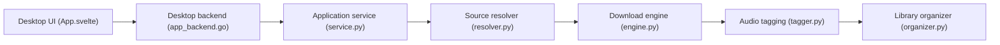

# anandprtp/Antra

> Application de bureau qui transforme des liens de services de streaming en bibliothèque musicale locale taguée.

## Le problème
Reconstituer à la main une bibliothèque locale propre (FLAC, MP3…) à partir de liens de streaming : métadonnées, pochettes, paroles, rangement.

## Ce que ça fait vraiment
- Prend un lien, récupère les métadonnées, résout une source audio, télécharge.
- Tague le fichier (titre, artiste, album, pochette, genre, paroles) et le range en `Artiste / Album`.
- Sorties FLAC, ALAC, AAC, MP3 ; compatible Navidrome, Jellyfin, Plex.
- Code : interface Svelte/Wails (Go) plus service Python avec moteur de téléchargement.

## Comment c'est branché

## Essayer
Aucune commande documentée : télécharger le binaire des Releases (Antra.exe, .dmg, .AppImage), choisir le dossier et le format, coller un lien, « Add to Library ».

## Coût et pièges
Gratuit, pas de clé d'API mentionnée. Windows Defender peut signaler le binaire (le README parle de faux positif).

## Ce que ce n'est pas
Ni lecteur ni serveur multimédia. Le README rejette sur l'utilisateur la responsabilité légale : récupérer l'audio depuis des services de streaming peut violer leurs conditions. Origine exacte des sources audio non documentée.

## Alternatives
Aucune alternative nommée dans le README.

## Pour toi
À ignorer : outil grand public sans lien avec un travail data/IA/MLOps, au risque juridique réel et à la licence non identifiée.

