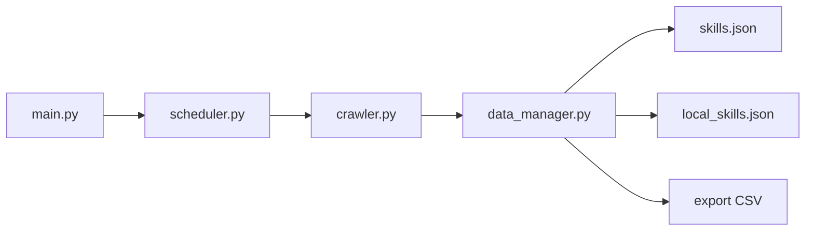

# anbeime/skill

> Catalogue de skills d'agents IA, surtout en chinois, avec un script de mise à jour automatique.

## Le problème
Retrouver parmi des milliers de skills d'agents ceux qui méritent d'être installés.

## Ce que ça fait vraiment
Agrège 182 skills « officiels » aspirés depuis awesome-agent-skills et 63 skills locaux (contenu, vidéo, e-commerce, PPT, voix), exportables en JSON ou CSV. `main.py` lance une mise à jour unique ou en démon, plus un validateur de `SKILL.md`. La fin du README est une longue liste de noms de dépôts, et il est tronqué en plein milieu de la section ClawHub.

## Comment c'est branché


## Essayer
```bash
git clone https://github.com/anbeime/skill.git
cd skill
pip install -r requirements.txt
python main.py --once
python main.py --stats
python main.py --export skills.csv
```

## Coût et pièges
Gratuit. Le catalogue ne déclare aucune licence alors que le README affirme « MIT License » : contradiction à vérifier. Plusieurs skills requièrent des API tierces (15 « API requise » d'après le JSON d'exemple). Le README contient des chemins Windows personnels (`D:\tool\skills\`) et des coordonnées de contact.

## Ce que ce n'est pas
Pas une source fiable de skills vérifiés : c'est un agrégat, avec des volets promotionnels (produit « 知易智能基座 », groupes WeChat).

## Alternatives
- VoltAgent/awesome-agent-skills : la source amont que ce dépôt aspire.

## Pour toi
À ignorer : agrégat principalement chinois, orienté contenu et e-commerce, sans licence claire ; va directement à la source amont.

