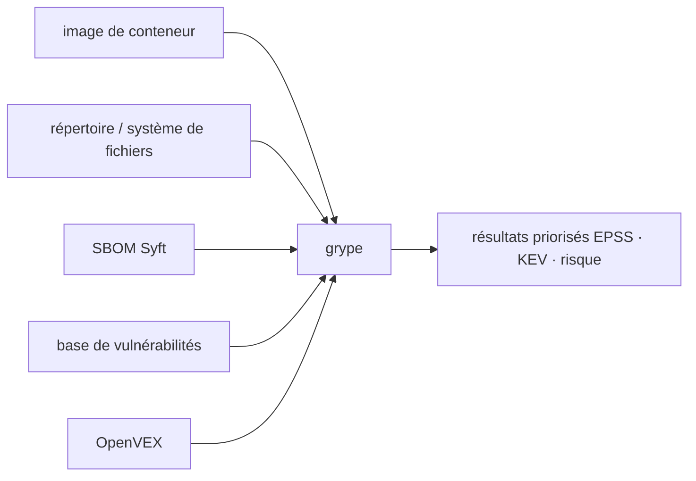

# anchore/grype

> Scanner de vulnérabilités pour images de conteneurs, systèmes de fichiers et SBOM.

## Le problème
Une image de conteneur empile des dizaines de paquets système et de dépendances applicatives dont
personne ne connaît la liste exacte des CVE.

## Ce que ça fait vraiment
Grype scanne images de conteneurs, systèmes de fichiers et SBOM à la recherche de vulnérabilités
connues. Il couvre les grands écosystèmes de paquets système (Alpine, Debian, Ubuntu, RHEL, Oracle
Linux, Amazon Linux…) et les paquets par langage (Ruby, Java, JavaScript, Python, .NET, Go, PHP,
Rust…), aux formats Docker, OCI et Singularity. Il priorise le risque avec EPSS, KEV et un score de
risque, et accepte OpenVEX pour filtrer et enrichir les résultats.

## Comment c'est branché


## Essayer
```bash
curl -sSfL https://get.anchore.io/grype | sudo sh -s -- -b /usr/local/bin
grype alpine:latest
grype ./my-project
grype sbom:./sbom.json
cat ./sbom.json | grype
```

## Coût et pièges
Gratuit. L'installation par défaut passe par un `curl | sudo sh` depuis `get.anchore.io` — Homebrew,
Docker, Chocolatey et MacPorts existent en alternative. Une base de vulnérabilités se télécharge et
se met à jour, ce qui suppose un accès réseau depuis l'environnement de scan.

## Ce que ce n'est pas
Ce n'est pas un générateur de SBOM : Grype en consomme un (format Syft), il ne le produit pas. Ce
n'est pas un outil de remédiation ni un scanner de configuration : il liste des vulnérabilités
connues, il ne corrige rien et ne juge pas l'exploitabilité réelle dans ton contexte.

## Alternatives
Aucune alternative n'est nommée ; Syft, du même éditeur, est le producteur de SBOM en amont.

## Pour toi
À câbler en CI sur tes images de jobs et de services d'inférence : scanner le SBOM plutôt que
l'image est nettement plus rapide.
