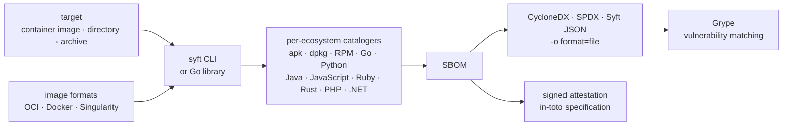

# anchore/syft

> **Inventory the packages inside an image or a directory, and emit a standard SBOM.**

## The problem

Finding out what is actually inside a container image is detective work: Alpine's apk packages,
the virtualenv's Python wheels, hand-copied Java jars and compiled Go binaries each live in their
own format, and no single `pip list` sees them all. Without an exhaustive inventory no
vulnerability scanner has anything to work from, and there is no answer on the day someone asks
"are we exposed to this CVE?".

## What it actually does

Syft is a command-line binary, doubled as a Go library, that reads a target and lists the packages
it contains. The stated targets are **container images**, **filesystems** and **archives**; on the
image side, OCI, Docker and [Singularity](https://github.com/sylabs/singularity) are named.

It covers "dozens" of packaging ecosystems: the README names Alpine (apk), Debian (dpkg), RPM, Go,
Python, Java, JavaScript, Ruby, Rust, PHP and .NET, pointing to the docs for the full list.

On output it writes an SBOM in several formats — **CycloneDX**, **SPDX**, **Syft JSON** — and can
convert an SBOM from one format to another. It also produces signed SBOM attestations following
the [in-toto](https://github.com/in-toto/attestation) specification.

What it does **not** do itself: find vulnerabilities. The README says so up front — the inventory
becomes useful alongside a scanner such as [Grype](https://github.com/anchore/grype), the sibling
project from the same vendor.

## How it is wired

No code-derived diagram exists for this repository: the graph below is reconstructed from the
README alone.



The thing to keep: Syft stops at the SBOM. The arrow to Grype leaves the repository.

## Trying it

```bash
curl -sSfL https://get.anchore.io/syft | sudo sh -s -- -b /usr/local/bin
```

```bash
# container image
syft alpine:latest

# directory
syft ./my-project
```

```bash
# SBOM to stdout
syft <image> -o cyclonedx-json

# Multiple SBOMs to files
syft <image> -o spdx-json=./spdx.json -o cyclonedx-json=./cdx.json
```

The README mentions other install routes (Homebrew, Docker, Scoop, Chocolatey, Nix) but gives
their commands only behind a documentation link, so they are not reproduced here.

## Cost and gotchas

- **Free, Apache-2.0, no API key.** The binary runs locally and no account creation is documented.
- **The quick install is a `curl | sudo sh`**: a remote script executed as root. On a corporate
  workstation or CI runner, prefer one of the packaged routes listed in the docs.
- **Registry dependency**: scanning `alpine:latest` means pulling the image from a remote registry
  — network, authentication and pull quotas included. That external dependency is what the alert
  flags.
- **No GPU, no stated RAM**: the README documents no hardware requirement. The size of the scanned
  image remains the real, unquantified cost driver.
- **Paid commercial support**: the README points to Anchore for support options on Syft and Grype.
  The tool is free; the hand-holding is not.
- **The logo is CC BY 4.0**, not Apache-2.0 — worth noting if you reuse it.

## What it is not

- **It is not a vulnerability scanner.** Syft says what is installed, not what is broken. Without
  Grype or an equivalent downstream you get a list, not an alert.
- **It is not a policy or compliance engine**: nothing in the README covers rules to enforce, CI
  gates or license management. The SBOM is produced; acting on it is your job.
- **It is not a source-code or infrastructure analyzer**: it inventories installed packages, not
  code flaws or misconfigurations.

## Alternatives

| | When to prefer it |
|---|---|
| **anchore/grype** | Named in the README, and a complement rather than a competitor: it consumes the SBOM Syft produces and matches it against vulnerability databases. Take it with Syft, not instead of it. |
| **aquasecurity/trivy** | Does inventory *and* vulnerability matching in a single binary. Prefer it if you want one end-to-end tool; prefer Syft if you want a clean, reusable SBOM decoupled from the scanner. |
| **bridgecrewio/checkov** | A different subject: static analysis of infrastructure as code (Terraform, Kubernetes). Prefer it to audit manifests, never to inventory an image's contents. |

`quay/clair` also appears among the catalog neighbours: vulnerability analysis as a service, on the
registry side — a different insertion point from the local binary that Syft is.

## For you

Adopt it as soon as a model image or a service image ships to production: it is the shortest route
to an exhaustive inventory of an ML image, where Python packages, system binaries and bundled CUDA
libraries mix precisely to the point of escaping any `pip freeze`. Wire it into CI next to Grype
rather than evaluating it alone: an SBOM is only worth what consumes it.
