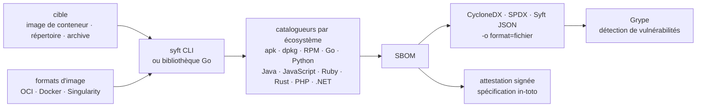

# anchore/syft

> **Inventorier les paquets d'une image ou d'un répertoire, et en sortir un SBOM normalisé.**

## Le problème

Savoir ce qu'il y a réellement dans une image de conteneur relève de l'enquête : l'apk d'Alpine,
les paquets Python du virtualenv, les jars Java copiés à la main et les binaires Go compilés
vivent chacun dans leur format, et aucun `pip list` ne les voit tous. Sans inventaire exhaustif,
aucun scanner de vulnérabilités ne peut travailler, et aucune réponse n'existe le jour où l'on
demande « est-ce qu'on est exposé à cette CVE ? ».

## Ce que ça fait vraiment

Syft est un binaire en ligne de commande, doublé d'une bibliothèque Go, qui lit une cible et
recense les paquets qu'elle contient. Les cibles annoncées sont les **images de conteneur**, les
**systèmes de fichiers** et les **archives** ; côté formats d'image, OCI, Docker et
[Singularity](https://github.com/sylabs/singularity) sont cités.

Il couvre « des dizaines » d'écosystèmes de paquetage : le README nomme Alpine (apk), Debian
(dpkg), RPM, Go, Python, Java, JavaScript, Ruby, Rust, PHP et .NET, et renvoie à la doc pour la
liste complète.

En sortie, il écrit un SBOM dans plusieurs formats — **CycloneDX**, **SPDX**, **Syft JSON** — et
sait convertir un SBOM d'un format vers un autre. Il produit aussi des attestations de SBOM
signées, selon la spécification [in-toto](https://github.com/in-toto/attestation).

Ce qu'il ne fait **pas** lui-même : détecter les vulnérabilités. Le README le pose d'emblée —
l'inventaire prend sa valeur avec un scanner comme [Grype](https://github.com/anchore/grype),
projet frère chez le même éditeur.

## Comment c'est branché

Aucun diagramme tiré du code n'existe pour ce dépôt : ce schéma est reconstruit depuis le seul
README.



Le point à retenir : Syft s'arrête au SBOM. La flèche vers Grype sort du dépôt.

## Essayer

```bash
curl -sSfL https://get.anchore.io/syft | sudo sh -s -- -b /usr/local/bin
```

```bash
# container image
syft alpine:latest

# directory
syft ./my-project
```

```bash
# SBOM to stdout
syft <image> -o cyclonedx-json

# Multiple SBOMs to files
syft <image> -o spdx-json=./spdx.json -o cyclonedx-json=./cdx.json
```

Le README mentionne d'autres voies d'installation (Homebrew, Docker, Scoop, Chocolatey, Nix) mais
ne donne leurs commandes que par lien vers la documentation : elles ne sont pas reproduites ici.

## Coût et pièges

- **Gratuit, Apache-2.0, aucune clé d'API.** Le binaire tourne en local, aucun compte à créer
  n'est documenté.
- **L'installation rapide est un `curl | sudo sh`** : un script distant exécuté en root. Pour un
  poste ou une CI d'entreprise, préférer une des voies packagées listées dans la doc.
- **Dépendance au registre** : scanner `alpine:latest` suppose de tirer l'image depuis un registre
  distant — réseau, authentification et quotas de pull compris. C'est la dépendance externe qui
  motive l'alerte.
- **Pas de GPU, pas de RAM annoncée** : le README ne documente aucun prérequis matériel. La taille
  de l'image analysée reste le facteur de coût réel, non chiffré.
- **Support commercial payant** : le README renvoie à Anchore pour les options de support sur Syft
  et Grype. L'outil est libre, l'accompagnement ne l'est pas.
- **Le logo est sous CC BY 4.0**, pas sous Apache-2.0 : à noter si on le réutilise.

## Ce que ce n'est pas

- **Ce n'est pas un scanner de vulnérabilités.** Syft dit ce qui est installé, pas ce qui est
  troué. Sans Grype ou équivalent en aval, on obtient une liste, pas une alerte.
- **Ce n'est pas un outil de politique ou de conformité** : rien dans le README ne parle de règles
  à faire respecter, de portes de CI ou de gestion de licences. Le SBOM est produit, son
  exploitation vous revient.
- **Ce n'est pas un analyseur de code source ni d'infrastructure** : il inventorie des paquets
  installés, pas des vulnérabilités de code ni des erreurs de configuration.

## Alternatives

| | Quand le préférer |
|---|---|
| **anchore/grype** | Nommé dans le README, c'est le complément plutôt que le concurrent : il consomme le SBOM produit par Syft et le confronte aux bases de vulnérabilités. À prendre avec Syft, pas à sa place. |
| **aquasecurity/trivy** | Fait l'inventaire *et* la détection de vulnérabilités dans un seul binaire. À préférer si l'on veut un outil unique de bout en bout ; Syft à préférer si l'on veut un SBOM propre, réutilisable, découplé du scanner. |
| **bridgecrewio/checkov** | Autre sujet : analyse statique de l'infrastructure as code (Terraform, Kubernetes). À préférer pour auditer des manifestes, jamais pour inventorier le contenu d'une image. |

`quay/clair` figure aussi parmi les voisins du catalogue : analyse de vulnérabilités en service,
côté registre — un autre point d'insertion que le binaire local qu'est Syft.

## Pour toi

À adopter dès qu'une image de modèle ou une image de service part en production : c'est le moyen
le plus court d'avoir un inventaire exhaustif d'une image ML, où les paquets Python, les binaires
système et les bibliothèques CUDA embarquées se mélangent justement au point d'échapper à tout
`pip freeze`. À câbler en CI aux côtés de Grype, pas à évaluer seul : le SBOM n'a d'intérêt que
s'il est consommé.
