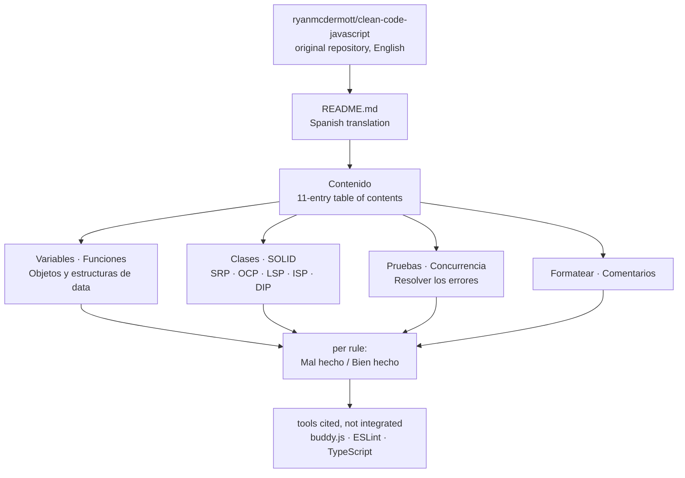

# andersontr15/clean-code-javascript-es

> **Clean Code principles adapted to JavaScript, translated into Spanish, readable in one page.**

## The problem

Readability rules circulate as code-review folklore: everyone agrees a variable name should
say something and a function should stay at one level of abstraction, but nobody has the short
before/after example at hand when the argument starts. And the reference material is in
English, which leaves part of a Spanish-speaking team out of a discussion that is precisely
about clarity.

## What it actually does

It is a single README with no runnable code: the Spanish translation of
`ryanmcdermott/clean-code-javascript`, named as the original repository on the very first line.

The content is a table of contents with eleven chapters — Introducción, Variables, Funciones,
Objetos y estructuras de data, Clases, SOLID, Pruebas, Concurrencia, Resolver los errores,
Formatear, Comentarios — each split into short rules.

Every rule follows the same template: an imperative heading, a paragraph or two of rationale,
then two JavaScript blocks labelled **Mal hecho** and **Bien hecho**. The identifiers inside
the examples are translated too (`fechaActual`, `crearMicroCerveceria`), which goes further
than translating comments alone.

The SOLID chapter walks through all five principles (SRP, OCP, LSP, ISP, DIP) with the same
template. The README points at third-party tools — `buddy.js` and an ESLint rule for magic
numbers, TypeScript as the answer to type checking — without integrating any of them.

## How it is wired

No code-derived diagram exists for this repository, and there would be nothing to derive: the
repository is a document. The diagram below is reconstructed from the README alone and shows
its reading structure, not a software architecture.



## Trying it

The README documents **no** command at all: no install, no npm package, no script, no
contribution procedure. There is nothing to run, only something to read.

```bash
# nothing to install: the repository is a single document
# no command is documented in the README
```

## Cost and gotchas

- **No runtime cost**: no API key, no GPU, no Docker, no third-party service, no account to
  create. The repository is not installed.
- **The cost is that of a derived translation**: the original repository, cited at the top,
  keeps moving on its own. The README never states which version of the original this
  translation matches, nor whether it is resynchronised.
- **The language cuts both ways**: example identifiers are Spanish (`conseguirUsuario`,
  `pintarCoche`), so they read as foreign in an English codebase — illustrations, not
  conventions to copy.
- **At least one substantive typo**: the magic-number rule discusses `86400000` milliseconds
  per day and then declares `const MILISEGUNDOS_EN_UN_DIA = 8640000`, one zero short.
- **The cited tools are not shipped**: ESLint, buddy.js and TypeScript must be installed and
  configured elsewhere; this repository holds no configuration.

## What it is not

- **Not a linter or a tool.** Nothing executes, nothing checks code: none of the rules is
  enforceable as written. Enforcing them means ESLint and a config you write yourself.
- **Not a style guide**: the README says so explicitly — it is about design, not indentation
  or semicolons, so it does not compete with Prettier or a formatting convention.
- **Not the original, and not a versioned edition of it**: it is a translation fork, and the
  README does not document its drift from `ryanmcdermott/clean-code-javascript`.

## Alternatives

| | When to prefer it |
|---|---|
| **ryanmcdermott/clean-code-javascript** | The original, named on the first line of the README. The default choice: it is the up-to-date, authoritative version. This translation only earns its place when reading in Spanish is the blocker. |
| **eslint/eslint** | Cited in the README for its `no-magic-numbers` rule. Prefer it when the goal is to *enforce* a rule rather than explain it — this document blocks no commit. |
| **danielstjules/buddy.js** | Cited alongside ESLint, focused on magic-number detection. A targeted complement, not a replacement for a team discussion. |

No catalogue neighbours were supplied with this repository: all three names come from the README.

## For you

Little direct value for a data / AI / MLOps profile: the content is object-oriented JavaScript,
far from pipelines and notebooks, and the English original remains the right entry point. Worth
watching in one case only — a Spanish-speaking team that needs a shared code-review baseline and
for which language is the real barrier. Otherwise, bookmark the original and move on.
