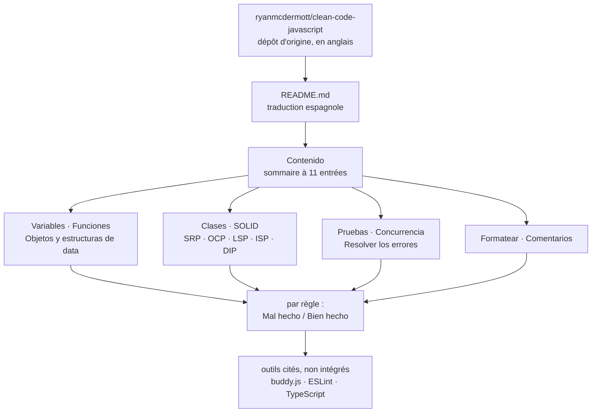

# andersontr15/clean-code-javascript-es

> **Les principes de *Clean Code* adaptés à JavaScript, traduits en espagnol, à lire en une page.**

## Le problème

Les règles de lisibilité du code circulent sous forme d'anecdotes de revue de code : chacun
sait qu'un nom de variable doit être parlant ou qu'une fonction doit tenir à un seul niveau
d'abstraction, mais personne n'a sous la main l'exemple court qui montre le mauvais et le bon
côte à côte. Et la matière de référence est en anglais, ce qui exclut une partie d'une équipe
hispanophone d'une discussion qui porte justement sur la clarté.

## Ce que ça fait vraiment

C'est un README unique, sans code exécutable : la traduction en espagnol du dépôt
`ryanmcdermott/clean-code-javascript`, annoncé dès la première ligne comme dépôt d'origine.

Le contenu est un sommaire de onze chapitres — Introducción, Variables, Funciones, Objetos y
estructuras de data, Clases, SOLID, Pruebas, Concurrencia, Resolver los errores, Formatear,
Comentarios — chacun découpé en règles courtes.

Chaque règle suit le même gabarit : un titre impératif (« Utiliza nombres significativos y
pronunciables para las variables »), un ou deux paragraphes de justification, puis deux blocs
JavaScript étiquetés **Mal hecho** et **Bien hecho**. Les identifiants des exemples sont eux
aussi traduits (`fechaActual`, `crearMicroCerveceria`, `MILISEGUNDOS_EN_UN_DIA`), ce qui va
au-delà d'une traduction des seuls commentaires.

Le chapitre SOLID détaille les cinq principes un par un (SRP, OCP, LSP, ISP, DIP) avec le même
gabarit. Le README renvoie ponctuellement à des outils tiers — `buddy.js` et une règle ESLint
pour les nombres magiques, TypeScript comme réponse à la comprobación de tipos — sans les
intégrer.

## Comment c'est branché

Aucun diagramme tiré du code n'existe pour ce dépôt, et il n'y aurait rien à en tirer : le
dépôt est un document. Le schéma ci-dessous est reconstruit depuis le seul README et décrit sa
structure de lecture, pas une architecture logicielle.



## Essayer

Le README ne documente **aucune** commande : pas d'installation, pas de paquet npm, pas de
script, pas de procédure de contribution. Il n'y a rien à lancer, seulement à lire. La seule
action possible tient en une ligne, non écrite dans le README mais imposée par sa nature :

```bash
# rien à installer : le dépôt est un unique document
# aucune commande n'est documentée dans le README
```

## Coût et pièges

- **Aucun coût d'exécution** : pas de clé d'API, pas de GPU, pas de Docker, pas de service
  tiers, pas de compte à créer. Le dépôt ne s'installe pas.
- **Le coût est celui d'une traduction dérivée** : le dépôt d'origine, cité en tête, continue
  d'évoluer de son côté. Le README ne dit pas à quelle version de l'original cette traduction
  correspond, ni si elle est resynchronisée. Un lecteur qui s'y réfère peut travailler sur un
  état antérieur sans le savoir.
- **La langue est le piège inverse de l'intérêt** : les identifiants des exemples sont en
  espagnol (`conseguirUsuario`, `pintarCoche`), donc directement dépaysants dans une base de
  code anglophone — ce sont des illustrations, pas des conventions à copier.
- **Le README contient au moins une coquille de fond** : la règle sur les nombres magiques
  commente `86400000` millisecondes par jour puis déclare `const MILISEGUNDOS_EN_UN_DIA = 8640000`,
  un zéro de moins. Preuve que la relecture n'est pas garantie.
- **Les outils cités ne sont pas fournis** : ESLint, buddy.js et TypeScript restent à installer
  et configurer ailleurs, ce dépôt ne contient aucune configuration.

## Ce que ce n'est pas

- **Ce n'est pas un linter ni un outil.** Rien ne s'exécute, rien ne vérifie le code : aucune
  règle du document n'est automatisable en l'état. Pour faire appliquer ces principes, il faut
  ESLint et une configuration qu'il faut écrire soi-même.
- **Ce n'est pas un guide de style** : le README le dit explicitement — il ne parle pas
  d'indentation ni de point-virgule, mais de conception. On ne peut donc pas l'opposer à
  Prettier ou à une convention de formatage, les deux répondent à des questions différentes.
- **Ce n'est pas l'original, ni sa version de référence** : c'est un fork de traduction, et le
  README ne documente pas son décalage avec `ryanmcdermott/clean-code-javascript`.

## Alternatives

| | Quand le préférer |
|---|---|
| **ryanmcdermott/clean-code-javascript** | Le dépôt d'origine, nommé en première ligne du README. À préférer par défaut : c'est la version à jour et la seule qui fasse autorité. Cette traduction ne se justifie que si la lecture en espagnol est le point bloquant. |
| **eslint/eslint** | Cité dans le README pour sa règle `no-magic-numbers`. À préférer quand l'objectif est de *faire appliquer* une règle plutôt que de l'expliquer — ce document ne bloque aucun commit. |
| **danielstjules/buddy.js** | Cité à côté d'ESLint, spécialisé dans la détection des nombres magiques. Utile en complément ciblé, pas en remplacement d'une discussion d'équipe. |

Aucun voisin de catalogue n'a été fourni avec ce dépôt : ces trois noms viennent tous du README.

## Pour toi

Peu d'intérêt direct pour un profil data / IA / MLOps : le contenu est du JavaScript orienté
objet, loin des pipelines et des notebooks, et l'original anglophone reste la bonne porte
d'entrée. À surveiller uniquement dans un cas précis — une équipe hispanophone à qui l'on veut
donner une base commune de revue de code, et où la langue est la vraie barrière. Sinon, passer
son chemin et garder le dépôt d'origine en signet.
