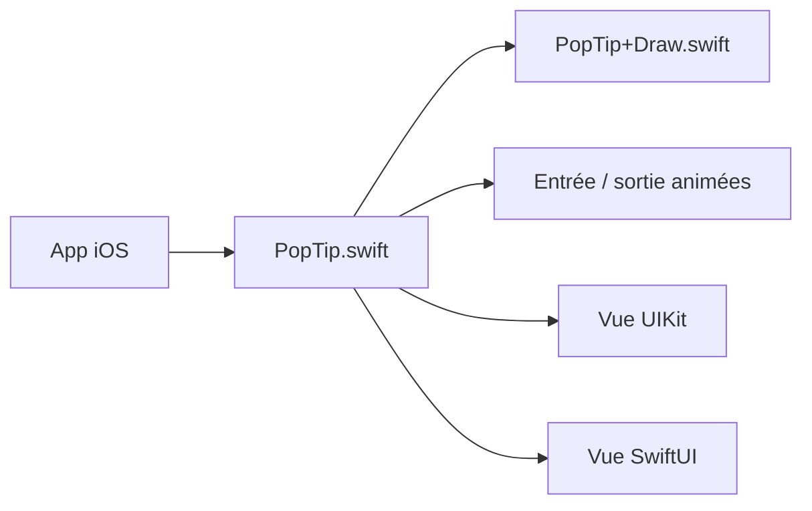

# andreamazz/AMPopTip

> Bibliothèque iOS Swift qui affiche des bulles animées avec flèche, pour guider l'utilisateur dans l'interface.

## Le problème
Afficher une info-bulle ancrée sur un élément d'écran iOS, avec direction, flèche et animation, demande beaucoup de code UIKit de dessin et de positionnement.

## Ce que ça fait vraiment
Une classe `PopTip` affiche un texte, une vue UIKit ou une vue SwiftUI (via `UIHostingController`) dans une bulle pointant vers un cadre. Direction fixe ou automatique, masque d'arrière-plan avec découpe, animations d'entrée et d'action, gestes (tap, swipe, tap extérieur) avec callbacks. Le style passe par l'appearance proxy ou des propriétés publiques.

## Comment c'est branché


## Essayer
```bash
pod install
carthage update
```
```swift
let popTip = PopTip()
popTip.show(text: "Hey! Listen!", direction: .up, maxWidth: 200, in: view, from: someView.frame)
```
(Le README demande d'ajouter `pod 'AMPopTip'` au Podfile, ou `github "andreamazz/AMPopTip"` au Cartfile.)

## Coût et pièges
Gratuit, aucun service. Le cadre fourni doit être dans le repère absolu de la vue de présentation (conversion `convertRect(_:toView:)`). Une vue parente trop petite coupe la bulle : `clipsToBounds = false` et `constrainInContainerView = false`.

## Ce que ce n'est pas
Pas une solution de parcours d'onboarding complet : c'est une seule bulle à la fois. Réservé à iOS (Swift 4.2+ indiqué). Aucune mention de Swift Package Manager dans le README. Dernier push en mars 2024.

## Alternatives
Aucune alternative nommée dans le README.

## Pour toi
Ignorer : hors de tes domaines data/IA/MLOps (UI mobile iOS), et le dépôt n'a pas bougé depuis plus d'un an ; utile seulement si tu développes en Swift.

