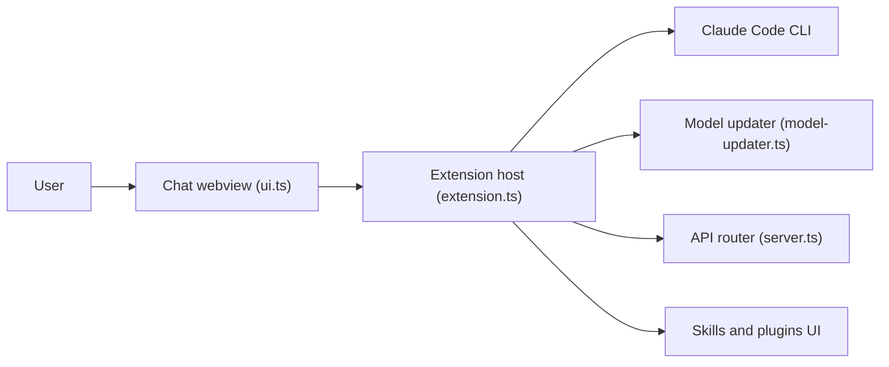

# andrepimenta/claude-code-chat

> Extension VS Code qui remplace le terminal de Claude Code par une interface de chat, pour développeurs.

## Le problème
Utiliser Claude Code en ligne de commande est moins confortable que dans l'éditeur, sans historique visuel ni restauration d'état.

## Ce que ça fait vraiment
L'extension lance le CLI Claude Code et relaie ses événements dans un webview : streaming, diff intégrés, checkpoints Git pour restaurer l'état, historique de conversation, gestion des permissions (mode « YOLO » possible), images collées, modes Plan et réflexion. Elle propose aussi un marché de serveurs MCP, skills et plugins, et un routeur compatible OpenAI pour d'autres modèles.

## Comment c'est branché


## Essayer
```bash
ext install claude-code-chat
```
Puis `Ctrl+Shift+C` (ou `Cmd+Shift+C`) pour ouvrir le chat.

## Coût et pièges
Il faut le CLI Claude Code, Node 18+ et une API ou un abonnement Claude (coût à ta charge). Le mode YOLO supprime les vérifications de permissions. 178 issues ouvertes.

## Ce que ce n'est pas
Ce n'est pas un client officiel Anthropic ; l'auteur indique l'avoir construit avec Claude Code. Licence présente mais non identifiée par GitHub.

## Alternatives
Aucune alternative nommée dans le README.

## Pour toi
À surveiller : pratique si tu travailles dans VS Code ou Cursor avec Claude Code, mais la licence floue et 178 issues ouvertes invitent à tester avant d'en dépendre.

