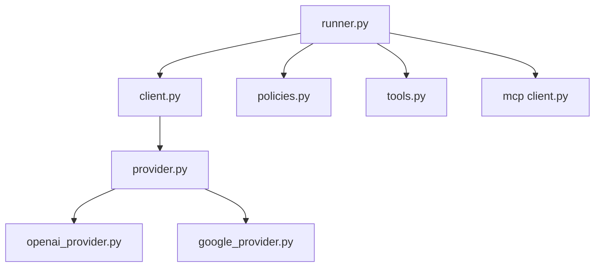

# andrewyng/aisuite

> API Python unique, à la façon d'OpenAI, pour appeler plusieurs LLM et construire des agents outillés.

## Le problème
Chaque fournisseur a son SDK, ses paramètres et son format d'appel d'outils. Passer de l'un à l'autre oblige à réécrire le code.

## Ce que ça fait vraiment
`client.chat.completions.create(model="openai:gpt-4o")` : on change de fournisseur en changeant une chaîne. Il gère le streaming et l'async.
Les fonctions Python deviennent des outils, et `max_turns` exécute la boucle d'appels.
L'API Agents ajoute `Runner`, des toolkits (fichiers, git, shell), des politiques d'approbation, une persistance d'état (Postgres) et du traçage.
Il accepte les serveurs MCP. Un SDK JS est à part.

## Comment c'est branché


## Essayer
```bash
pip install aisuite
pip install 'aisuite[anthropic]'
pip install 'aisuite[all]'
```

## Coût et pièges
Les clés des fournisseurs sont à ta charge. Les toolkits shell et fichiers doivent être encadrés par des politiques.

## Ce que ce n'est pas
Ce n'est pas l'appli OpenWorker, qui vit maintenant dans un autre dépôt. Ce n'est pas une passerelle proxy : tout se passe dans le processus.

## Alternatives
Le README ne nomme aucun dépôt alternatif.

## Pour toi
À adopter : une couche d'abstraction légère et lisible, utile pour comparer des modèles ou écrire des agents simples sans t'enfermer chez un fournisseur.
