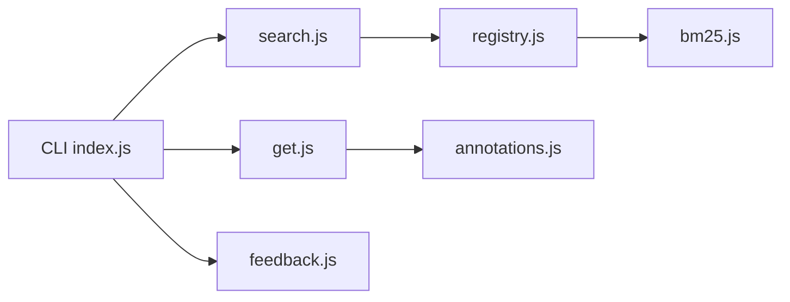

# andrewyng/context-hub

> CLI et serveur MCP qui servent aux agents de code des docs d'API versionnées.

## Le problème
Les agents de code inventent des API et oublient en fin de session ce qu'ils ont appris.

## Ce que ça fait vraiment
`chub search` interroge un registre (classement BM25), `chub get <id> --lang py|js` récupère la doc (fichiers de référence à la demande). L'agent peut ajouter des annotations locales persistantes (`chub annotate`, rejouées avec `--with-annotations`, traitées comme non fiables) et voter la doc (`chub feedback`), envoyé aux auteurs. Contenu en Markdown dans le dépôt.

## Comment c'est branché


## Essayer
```bash
npm install -g @aisuite/chub
chub search openai
chub get openai/chat --lang py
chub annotate stripe/api "Needs raw body for webhook verification"
```

## Coût et pièges
Gratuit. Retours et statistiques d'usage partent vers un service de feedback et PostHog (anonyme). Les annotations réinjectées dans le contexte constituent une surface d'injection de prompt. Dernier push en mai 2026.

## Ce que ce n'est pas
Pas fait pour être utilisé à la main : pensé pour l'agent. Couverture des docs limitée à ce qui est contribué ; autres types de contenu à venir.

## Alternatives
Aucune alternative nommée dans le README.

## Pour toi
Pertinent pour réduire les API hallucinées de ton agent de code ; teste-le sur quelques bibliothèques et vérifie ce que la télémétrie envoie.

