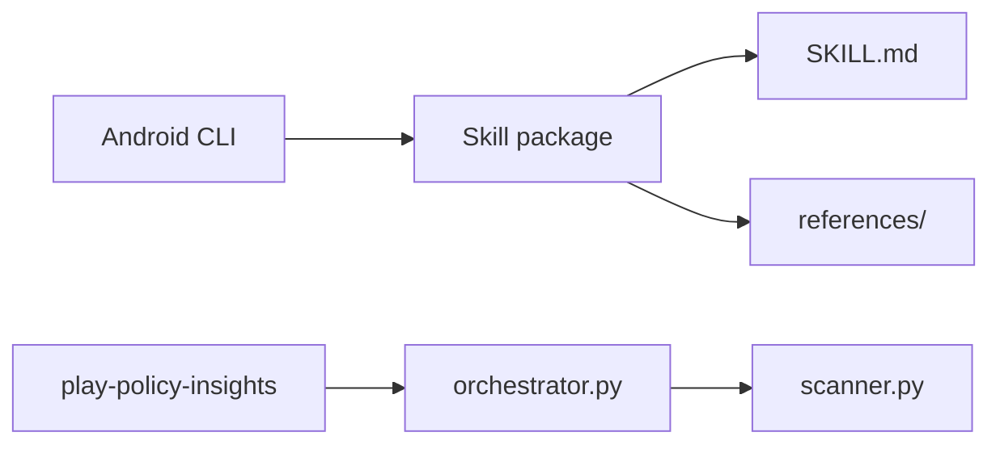

# android/skills

> Skills d'agents IA pour Android, installables avec Android CLI, sur des workflows où les LLM échouent.

## Le problème
Les LLM appliquent mal certains schémas Android récents (migrations, R8, navigation 3…).

## Ce que ça fait vraiment
Dépôt de dossiers `SKILL.md` avec références issues de developer.android.com, par domaine : build, AppFunctions, Compose, navigation, Play, performance, sécurité, tests, Wear, XR. Une exception exécutable : `play/play-policy-insights` (scripts Python d'analyse des politiques Play).

## Comment c'est branché


## Essayer
```bash
android skills add r8-analyzer --project=.
android skills add --all
android skills update --all
```

## Coût et pièges
Gratuit. Sans dossier d'agent existant, l'installation cible Gemini et Antigravity. Le README rappelle que l'IA peut se tromper.

## Ce que ce n'est pas
Pas une bibliothèque Android : ce sont des instructions pour agents.

## Alternatives
Aucune alternative nommée dans le README.

## Pour toi
Surveiller : modèle instructif de skills bien structurés, mais utile surtout si tu développes sous Android.

