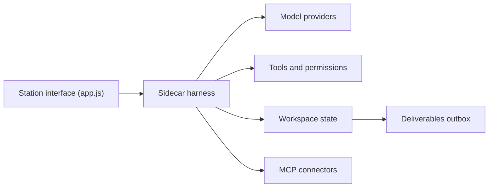

# androoAGI/starnet

> Application de bureau qui représente des agents IA comme une station en pixel art dont le plan pilote le travail.

## Le problème
Les agents lancés en chat n'ont ni périmètre, ni traçabilité de coût, ni livrables clairs.

## Ce que ça fait vraiment
Un sidecar Node local exécute de vrais appels de modèles et outils, avec droits bornés, espaces de travail séparés, mémoire, transcriptions et registres de dépenses sur disque. L'interface (JavaScript, coque Tauri) projette l'état réel : une salle est une équipe, un couloir une passation autorisée. Canaux Telegram, Discord, Slack, Signal et Matrix, connecteurs MCP, planifications, mode « Night Shift ».

## Comment c'est branché


## Essayer
```bash
git clone https://github.com/androoAGI/starnet.git
cd starnet
node sidecar/index.js
npm run desktop:dev
```

## Coût et pièges
Clé OpenRouter ou connexion OAuth (Anthropic, OpenAI, Google), ou Ollama en local (modèles plus petits). Windows est la cible la plus testée ; macOS moins ; Linux non supporté publiquement. Les requêtes de modèles quittent la machine.

## Ce que ce n'est pas
Pas un outil d'orchestration de pipelines data. Le README parle d'une « sortie anticipée » ; les garanties (« rien de simulé ») sont des engagements de l'auteur.

## Alternatives
Aucune alternative citée ; le README propose seulement d'importer un agent depuis OpenClaw ou Hermes.

## Pour toi
À ignorer : harnais d'agents généralistes en version précoce, tenu par une personne, sans lien avec un travail data ou MLOps.
