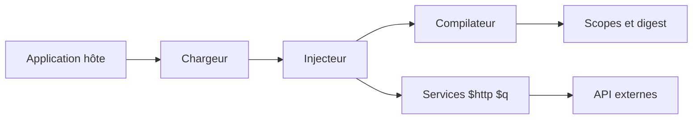

# angular/angular.js

> Ancien framework JavaScript à liaison de données bidirectionnelle, dont le support est terminé.

## Le problème
Construire des applications web monopages avec des gabarits HTML, de l'injection de dépendances et une synchronisation automatique vue/modèle.

## Ce que ça fait vraiment
AngularJS étend le HTML avec des directives, synchronise interface et objets JavaScript (scopes, boucle de digest), fournit un injecteur, un compilateur de gabarits, `$http`, `$q` et des modules optionnels (ngRoute, ngResource, ngAnimate, ngSanitize…). Le support a officiellement pris fin en janvier 2022 ; le dépôt est archivé, dernier push 2024-04-12.

## Comment c'est branché

## Essayer
Aucune commande documentée : le README renvoie au tutoriel sur docs.angularjs.org.

## Coût et pièges
Gratuit, mais plus de correctifs ; le README renvoie vers angular.io pour la version suivie.

## Ce que ce n'est pas
Ce n'est pas Angular (le framework actuel) : AngularJS est un projet distinct et arrêté.

## Alternatives
Aucune alternative nommée dans le README, sauf le renvoi vers angular.io.

## Pour toi
Ignorer : archivé et hors de support, sans intérêt pour un profil data ou IA.

