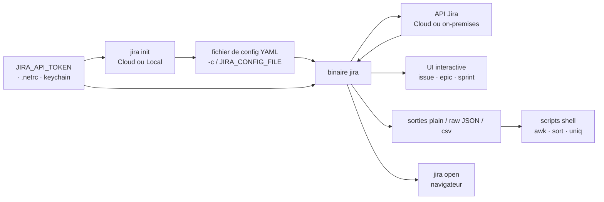

# ankitpokhrel/jira-cli

> **A Jira client for the terminal: search, create and transition tickets without opening the web UI.**

## The problem

Keeping up with Jira tickets means opening a browser, waiting for a heavy UI to load, and
clicking through filters to express what a three-word query would describe. Worse, the result
stays in the browser: you cannot pipe it into a shell script.

## What it actually does

JiraCLI talks to the Jira API (Cloud as well as Server / on-premises) and renders results in
the terminal:

- **Interactive explorer** for issues, epics and sprints: keyboard navigation (`j/k/h/l`,
  `g/G`), `v` to view a ticket, `m` to transition it, `ENTER` to open it in the browser, `c` to
  copy the URL (needs `xclip`/`xsel` on Linux).
- **Composable filters** as POSIX flags: assignee, reporter, status, priority, label, time
  windows (`--created -7d`, `--created month`, `--updated -30m`), with `~` acting as a NOT
  operator — plus a `--jql/-q` escape hatch for raw JQL.
- **Write operations**: `create`, `edit`, `assign`, `move`, `link` / `unlink` / `link remote`,
  `clone` (with string replacement via `-H`), `delete --cascade`, `comment add`, `worklog add`.
  Descriptions and comments accept GitHub- or Jira-flavored Markdown, a `--template` file, or
  standard input.
- **Machine-readable output**: `--plain`, `--raw` (JSON), `--csv`, `--columns`, `--no-headers` —
  which is what makes the README's shell scripts (tickets per day, per sprint) possible.
- **Reading**: `jira issue view` roughly converts the Atlassian document to Markdown and pages
  it through `less`; the README warns that not all Atlassian nodes translate correctly.

## How it is wired

No code-derived diagram exists for this repository; the sketch below is reconstructed from the
README alone (environment variables, `jira init`, config file, output modes).



## Trying it

Commands exactly as the README gives them:

```bash
docker run -it --rm ghcr.io/ankitpokhrel/jira-cli:latest
jira init
jira issue list
jira issue list -yHigh -s"To Do" --created month -lbackend -a$(jira me)
jira issue list --plain --columns created --no-headers
jira issue create -tBug -s"New Bug" -yHigh -lbug -lurgent -b"Bug description" --fix-version v2.0 --no-input
jira issue move ISSUE-1 "In Progress" --comment "Started working on it"
jira issue view ISSUE-1 --comments 5
jira sprint list --current -a$(jira me)
jira completion --help
```

The binary is downloaded from the releases page; Homebrew, Nix and other install methods are
deferred to the installation wiki, outside the README.

## Cost and gotchas

- **The tool is free and MIT-licensed, but you need a Jira** — a paid Atlassian service. The
  real cost is the instance licence, not the CLI.
- **A token is mandatory**: `JIRA_API_TOKEN` (an Atlassian API token for Cloud, your password
  or a PAT with `JIRA_AUTH_TYPE=bearer` for on-premises), exported in the shell or placed in
  `.netrc` / the keychain. `basic`, `bearer` and `mtls` (client certificates) are supported.
- **Windows support is only partial** per the README's platform table.
- **Non-English instances**: the README warns that issue/epic creation may break, and that you
  then have to fill `epic.name`, `epic.link` and `issue.types.*.handle` by hand in the
  generated config.
- **Stated limits**: only 25 recent sprints shown, at most 50 issues per `epic add` /
  `epic remove` / `sprint add`, and the displayed comment may not be the latest beyond 5k
  comments.
- **Clipboard copy** depends on `xclip` / `xsel` on Linux.

## What it is not

- **Not a Jira and not a local cache**: without a reachable instance and a valid token it does
  nothing; everything is a call to the remote API.
- **Not a Go library to import**: the README documents a binary and its subcommands, no
  programmatic API. For code, you fall back to the Jira REST API.
- **Not full Jira coverage**: the README says so itself ("may not be able to do everything"),
  the Atlassian-to-Markdown conversion is approximate, and behaviour differs in places between
  Cloud and on-premises.

## Alternatives

| | When to prefer it |
|---|---|
| **cli/cli (GitHub CLI)** | Named in the README as the direct inspiration. Prefer it when work tracking lives in GitHub issues rather than Jira — same terminal reflexes, different back end. |

The catalogue's suggested neighbours are not comparable: `charmbracelet/bubbletea`,
`charmbracelet/lipgloss` and `charmbracelet/glamour` are Go libraries for building terminal
interfaces, not Jira clients, and `ayn2op/discordo` is a terminal Discord client — similar
ergonomics, unrelated service and use case.

## For you

Little methodological interest for a data/AI profile, but a real daily friction saver if your
team lives in Jira: `--plain --columns --no-headers` and `--raw` turn the backlog into a
scriptable data source (tickets per day, per sprint, per assignee) without hand-rolling REST
calls. Watch rather than depend on it: a single-maintainer project sitting entirely on a SaaS
you do not control.
