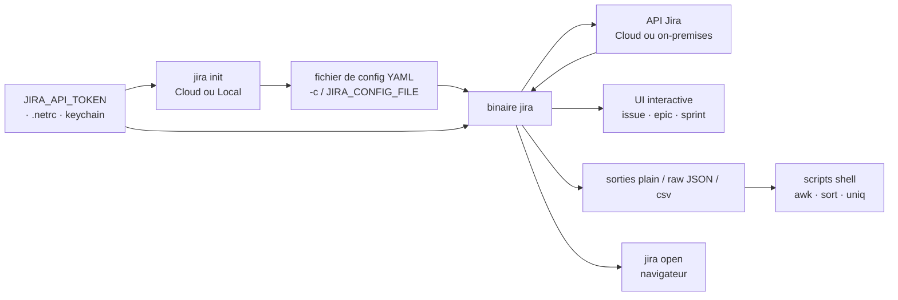

# ankitpokhrel/jira-cli

> **Client Jira en ligne de commande : chercher, créer et faire transiter des tickets sans ouvrir l'interface web.**

## Le problème

Suivre ses tickets Jira impose d'ouvrir un navigateur, d'attendre le chargement d'une interface
lourde et de cliquer dans des filtres pour retrouver ce qu'une requête de trois mots décrirait.
Et le résultat reste dans le navigateur : impossible de l'enchaîner dans un script shell.

## Ce que ça fait vraiment

JiraCLI parle à l'API Jira (Cloud comme Server/on-premises) et rend le résultat dans le
terminal. Concrètement :

- **Explorateur interactif** d'issues, d'epics et de sprints : navigation clavier (`j/k/h/l`,
  `g/G`), `v` pour voir un ticket, `m` pour le faire transiter, `ENTER` pour l'ouvrir dans le
  navigateur, `c` pour copier l'URL (nécessite `xclip`/`xsel` sous Linux).
- **Filtres combinables** en drapeaux POSIX : assigné, rapporteur, statut, priorité, label,
  fenêtre temporelle (`--created -7d`, `--created month`, `--updated -30m`), le tilde `~`
  servant de négation. Et une échappatoire `--jql/-q` pour écrire du JQL brut.
- **Écriture** : `create`, `edit`, `assign`, `move`, `link` / `unlink` / `link remote`, `clone`
  (avec remplacement de texte via `-H`), `delete --cascade`, `comment add`, `worklog add`.
  Descriptions et commentaires acceptent le Markdown GitHub ou Jira, un template (`--template`)
  ou l'entrée standard.
- **Sorties machine** : `--plain`, `--raw` (JSON), `--csv`, `--columns`, `--no-headers` — c'est
  ce qui rend les scripts d'exemple du README possibles (tickets par jour, par sprint).
- **Rendu lecture** : `jira issue view` convertit approximativement le document Atlassian en
  Markdown et l'affiche via `less` ; le README prévient que tous les nœuds Atlassian ne sont
  pas traduits correctement.

## Comment c'est branché

Aucun diagramme tiré du code n'existe pour ce dépôt : ce schéma est reconstruit depuis le seul
README (variables d'environnement, `jira init`, fichier de configuration, modes de sortie).



## Essayer

Commandes telles qu'elles figurent dans le README :

```bash
docker run -it --rm ghcr.io/ankitpokhrel/jira-cli:latest
jira init
jira issue list
jira issue list -yHigh -s"To Do" --created month -lbackend -a$(jira me)
jira issue list --plain --columns created --no-headers
jira issue create -tBug -s"New Bug" -yHigh -lbug -lurgent -b"Bug description" --fix-version v2.0 --no-input
jira issue move ISSUE-1 "In Progress" --comment "Started working on it"
jira issue view ISSUE-1 --comments 5
jira sprint list --current -a$(jira me)
jira completion --help
```

Le binaire se télécharge depuis la page des releases ; Homebrew, Nix et les autres méthodes
renvoient au wiki d'installation, hors README.

## Coût et pièges

- **Outil gratuit, MIT — mais il faut un Jira**, et Jira est un service payant d'Atlassian :
  le coût réel est celui de la licence de l'instance, pas de l'outil.
- **Jeton obligatoire** : `JIRA_API_TOKEN` (jeton d'API Atlassian pour le Cloud, mot de passe
  ou PAT pour l'on-premises avec `JIRA_AUTH_TYPE=bearer`), exporté dans le shell, ou posé dans
  `.netrc` / le trousseau. Auth `basic`, `bearer` et `mtls` (certificats client) supportées.
- **Windows n'est que partiellement supporté** selon le tableau de plateformes du README.
- **Instance non anglophone** : le README avertit que la création d'issue/epic peut échouer, et
  qu'il faut alors remplir `epic.name`, `epic.link` et `issue.types.*.handle` à la main dans la
  configuration générée.
- **Plafonds annoncés** : 25 sprints récents affichés, 50 issues au plus par `epic add` /
  `epic remove` / `sprint add`, commentaire affiché possiblement faux au-delà de 5000 commentaires.
- **Copie du presse-papier** dépendante de `xclip` / `xsel` sous Linux.

## Ce que ce n'est pas

- **Ce n'est pas un Jira ni un cache local** : sans instance accessible et sans jeton valide,
  l'outil ne fait rien ; tout passe par des appels à l'API distante.
- **Ce n'est pas une bibliothèque Go à importer** : le README ne documente qu'un binaire et ses
  sous-commandes, pas une API programmatique. Pour du code, on retombe sur l'API REST Jira.
- **Ce n'est pas une couverture complète de Jira** : le README le dit lui-même (« may not be
  able to do everything »), la conversion Atlassian → Markdown est approximative, et le
  comportement diffère par endroits entre Cloud et on-premises.

## Alternatives

| | Quand le préférer |
|---|---|
| **cli/cli (GitHub CLI)** | Cité par le README comme l'inspiration directe. À préférer si le suivi de travail vit dans les issues GitHub plutôt que dans Jira — mêmes réflexes de terminal, autre back-end. |

Les voisins proposés par le catalogue ne sont pas comparables : `charmbracelet/bubbletea`,
`charmbracelet/lipgloss` et `charmbracelet/glamour` sont des bibliothèques Go pour construire
des interfaces terminal, pas des clients Jira, et `ayn2op/discordo` est un client Discord en
terminal — même famille d'ergonomie, service et usage sans rapport.

## Pour toi

Peu d'intérêt méthodologique pour un profil data/IA, mais un gain de friction quotidien réel si
ton équipe vit dans Jira : `--plain --columns --no-headers` et `--raw` transforment le backlog
en source de données scriptable (tickets par jour, par sprint, par assigné) sans passer par
l'API REST à la main. À surveiller plutôt qu'à adopter en dépendance : projet porté par une
seule personne, et tout repose sur un SaaS que tu ne contrôles pas.
