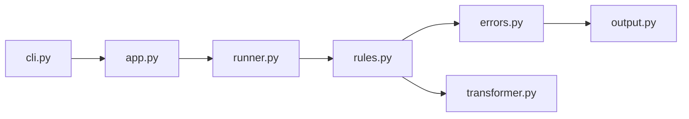

# ansible/ansible-lint

> Linter de playbooks et rôles Ansible qui signale les pratiques douteuses, utilisable en CI via GitHub Action.

## Le problème
Les playbooks dérivent vers des pratiques fragiles (syntaxe, idempotence, schémas) sans contrôle automatique.

## Ce que ça fait vraiment
Une commande lance un run : découverte des fichiers, chargement YAML, application des règles, puis rapport via des formateurs. Branches séparées pour la vérification de syntaxe, la validation de schéma, les exclusions (skip) et les corrections automatiques. Ne prend en charge que les deux dernières versions majeures d'Ansible.

## Comment c'est branché


## Essayer
```yaml
# .github/workflows/ansible-lint.yml
name: ansible-lint
on:
  pull_request:
    branches: ["main", "stable", "release/v*"]
jobs:
  build:
    name: Ansible Lint
    runs-on: ubuntu-24.04
    steps:
      - uses: actions/checkout@v6
      - name: Run ansible-lint
        uses: ansible/ansible-lint@main
```

## Coût et pièges
Gratuit. Le README recommande d'épingler un tag de release plutôt que `@main` en production.

## Ce que ce n'est pas
Ni un exécuteur ni un testeur de playbooks : il analyse statiquement. Licence GPLv3 à cause de dépendances, le code propre restant historiquement MIT.

## Alternatives
yamllint est utilisé en dépendance, pas en remplacement.

## Pour toi
Pertinent si tu automatises de l'infra MLOps avec Ansible ; sinon à garder en tête : surveiller.

