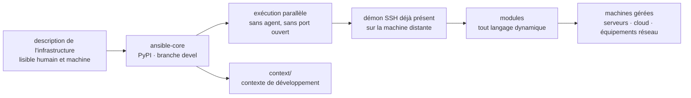

# ansible/ansible

> **Fleet-wide IT automation driven by readable files, executed over SSH with nothing installed on targets.**

## The problem

Configuring, updating and deploying across many machines by hand does not hold: servers drift
apart, procedures end up in shell scripts nobody can replay, and every new host needs a
bootstrapping step first. Tools that address this usually require an agent on each host and
extra open ports, which moves the operational burden rather than removing it.

## What it actually does

The README describes a system for configuration management, application deployment, cloud
provisioning, ad-hoc task execution, network automation and multi-node orchestration. The
example it gives is a zero-downtime rolling update behind a load balancer.

The technical stance is in the listed design principles: no custom agent and no additional open
port, relying on the SSH daemon already running; a brand-new remote machine is manageable
immediately, with nothing installed on it first; infrastructure is described in a language that
is both machine- and human-friendly; machines are managed in parallel; the tool is usable as
non-root. The README also stresses auditability — content should be easy to review and rewrite.

This repository is `ansible-core`, published on PyPI under that name. Modules may be written in
any dynamic language, not only Python.

## How it is wired

No code-derived diagram exists for this repository: the graph above is reconstructed from the
README alone. The only file path the README names is the `context/` directory, which holds the
development context for `ansible-core`. The structural point is the absence of any component
installed on the managed machine: the chain stops at the SSH daemon.

## Trying it

The README gives **no command to copy**: it points to the installation guide for installing a
released version "with `pip` or a package manager", without writing the corresponding line. The
PyPI package name is `ansible-core` (badge at the top of the README) and reference documentation
lives on `docs.ansible.com`. Nothing is reconstructed here.

For contributing, the README describes a procedure rather than commands: branch off `devel`, set
up a development environment following the developer guide, then open a pull request against
`devel` — discussing larger changes beforehand.

## Cost and traps

- **GPL-3.0 or later**: strong copyleft, stated in the README and in the catalogue. This is the
  point to clear before any use inside a distributed product; for internal operations it has no
  practical effect.
- **No infrastructure cost of its own**: no API key, no third-party service, no account to create
  according to the README. The real prerequisites are SSH access to the target machines and a
  Python to install `ansible-core`.
- **Two branches, two contracts**: `devel` carries the release under development and the README
  warns that breaking changes are more likely there; `stable-2.X` branches track published
  releases. Picking a branch is an operational decision, not a detail.
- **The README does not document** supported Python versions, target operating systems, or the
  exact set of shipped modules: all of it is deferred to external documentation.
- **Governance**: created by Michael DeHaan, contributions from over 5000 users, sponsored by
  Red Hat, Inc. The dependency is strategic rather than technical.

## What it is not

- **Not the full `ansible` package**: this repository is `ansible-core`. The broader distribution
  with its collections is not what you install from here.
- **Not an agent or a running service**: nothing stays installed on managed machines, nothing
  listens. There is therefore no continuous monitoring and no automatic drift correction between
  runs — state is applied only when you run it.
- **Not a compute task orchestrator or pipeline engine**: it applies changes to machines, it does
  not schedule data processing workflows.
- **Not a graphical interface or a platform**: the repository ships the command-line engine, not
  the web portal sometimes associated with the name.

## Alternatives

No comparable alternative in the catalogue. The neighbours suggested for this repository
(`AstrBotDevs/AstrBot`, `MemoriLabs/Memori`, `Netflix/metaflow`, `flyteorg/flyte`) are off-topic:
the first two concern conversational agents and memory for language models, the latter two
orchestrate data and training pipelines on clusters — they schedule computations, where Ansible
changes the state of machines over SSH. The README names no competing tool.

## For you

This is the piece that brings a data or training environment into a reproducible state without
leaving anything permanent on the machines: node setup, drivers, system dependencies, deploying
an inference service. For a data / MLOps profile it complements pipeline orchestrators rather
than competing with them — one prepares machines, the other runs steps on them. Adopt it if you
manage servers; skip it if everything is already handled by container images and a cluster
scheduler.
