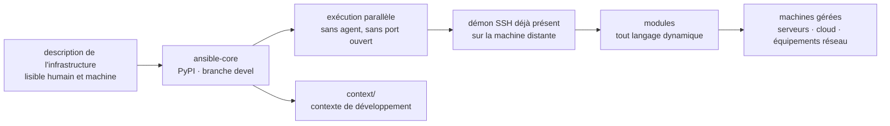

# ansible/ansible

> **Automatisation de parcs de machines par fichiers déclaratifs, exécutée à distance via SSH, sans agent installé.**

## Le problème

Configurer, mettre à jour et déployer sur plusieurs machines à la main ne tient pas : les
serveurs dérivent les uns des autres, les procédures vivent dans des scripts shell non
rejouables, et chaque nouvelle machine demande une phase d'amorçage. Les solutions qui
répondent à ce besoin imposent en général d'installer un agent sur chaque hôte et d'ouvrir des
ports supplémentaires, ce qui déplace le problème d'exploitation au lieu de le supprimer.

## Ce que ça fait vraiment

Le README décrit un système de gestion de configuration et d'exécution de tâches qui couvre
quatre usages annoncés : gestion de configuration, déploiement d'applications, provisionnement
cloud, exécution de tâches ponctuelles, automatisation réseau et orchestration multi-nœuds. Le
cas cité en exemple est la mise à jour progressive sans interruption derrière un répartiteur de
charge.

Le parti pris technique tient dans les principes de conception listés : pas d'agent et pas de
port supplémentaire, on s'appuie sur le démon SSH déjà présent ; une machine distante neuve est
pilotable immédiatement, sans rien y installer au préalable ; l'infrastructure est décrite dans
un langage lisible par une machine et par un humain ; l'exécution est parallèle ; l'outil est
utilisable sans être root. Le README insiste aussi sur l'auditabilité : le contenu doit pouvoir
être relu et réécrit facilement.

Le dépôt est celui d'`ansible-core`, publié sur PyPI sous ce nom. Les modules peuvent être
écrits dans n'importe quel langage dynamique, pas seulement en Python.

## Comment c'est branché

Aucun diagramme tiré du code n'existe pour ce dépôt : ce schéma est reconstruit depuis le seul
README. Le seul chemin de fichier que le README nomme est le répertoire `context/`, qui contient
le contexte de développement d'`ansible-core`. Le point structurant est l'absence de composant
installé côté machine gérée : la chaîne s'arrête au démon SSH.

## Essayer

Le README ne donne **aucune commande à copier** : il renvoie au guide d'installation pour
installer une version publiée « avec `pip` ou un gestionnaire de paquets », sans écrire la ligne
correspondante. Le nom du paquet PyPI est `ansible-core` (badge en tête de README), et la
documentation de référence est sur `docs.ansible.com`. Rien n'est reconstruit ici.

Pour contribuer, le README décrit la marche à suivre plutôt que des commandes : partir d'une
branche créée depuis `devel`, monter un environnement de développement d'après le guide
développeur, puis proposer une pull request vers `devel` — en discutant en amont des
changements importants.

## Coût et pièges

- **Licence GPL-3.0 or later** : copyleft fort, indiqué dans le README et dans le catalogue.
  C'est la contrainte à lever avant tout usage dans un produit distribué ; pour un usage interne
  d'exploitation, elle est sans effet pratique.
- **Aucun coût d'infrastructure propre** : pas de clé d'API, pas de service tiers, pas de compte
  à créer d'après le README. Le prérequis réel est un accès SSH aux machines cibles et un Python
  pour installer `ansible-core`.
- **Deux branches, deux contrats** : `devel` porte la version en cours de développement et le
  README prévient qu'on y rencontre plus probablement des ruptures ; les branches `stable-2.X`
  correspondent aux versions publiées. Le choix de branche est une décision d'exploitation, pas
  un détail.
- **Le README ne documente pas** les versions de Python supportées, les systèmes cibles, ni le
  périmètre exact des modules livrés : tout cela est renvoyé à la documentation externe.
- **Gouvernance** : projet créé par Michael DeHaan, plus de 5000 contributeurs, sponsorisé par
  Red Hat. La dépendance n'est pas technique mais stratégique.

## Ce que ce n'est pas

- **Ce n'est pas le paquet `ansible` complet** : ce dépôt est `ansible-core`. La distribution
  large avec ses collections n'est pas ce qu'on installe ici.
- **Ce n'est pas un agent ni un service qui tourne** : rien ne reste installé sur les machines
  gérées, rien n'écoute. Il n'y a donc ni surveillance continue ni correction automatique de
  dérive entre deux exécutions — l'état n'est appliqué que quand on lance.
- **Ce n'est pas un orchestrateur de tâches de calcul ni un moteur de pipelines** : il exécute
  des changements sur des machines, il ne planifie pas des flux de traitement de données.
- **Ce n'est pas une interface graphique ni une plateforme** : le dépôt livre le moteur en ligne
  de commande, pas le portail qu'on associe parfois au nom.

## Alternatives

Aucune alternative comparable dans le catalogue. Les voisins proposés pour ce dépôt
(`AstrBotDevs/AstrBot`, `MemoriLabs/Memori`, `Netflix/metaflow`, `flyteorg/flyte`) sont hors
sujet : les deux premiers relèvent des agents conversationnels et de la mémoire pour modèles de
langage, les deux suivants orchestrent des pipelines de données et d'apprentissage sur cluster —
ils planifient des traitements, là où Ansible modifie l'état de machines via SSH. Le README ne
nomme aucun outil concurrent.

## Pour toi

C'est la brique qui met un environnement de données ou d'apprentissage dans un état reproductible
sans rien installer de permanent sur les machines : montage de nœuds, pilotes, dépendances
système, déploiement d'un service d'inférence. Pour un profil data / MLOps, c'est un complément
des orchestrateurs de pipelines, pas leur concurrent — l'un prépare les machines, l'autre y fait
tourner des étapes. À adopter si l'on gère des serveurs ; à ignorer si tout est déjà géré par une
couche d'images conteneurisées et un ordonnanceur de cluster.
