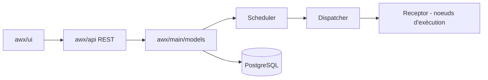

# ansible/awx

> Interface web, API REST et moteur de tâches au-dessus d'Ansible, amont de Red Hat Ansible Automation Platform.

## Le problème
Lancer des playbooks Ansible à plusieurs, avec droits, historique et planification, exige un contrôleur central.

## Ce que ça fait vraiment
Le README est court et met en avant un avertissement : la dernière version date du 2 juillet 2024, les publications sont en pause pendant un grand chantier de refonte. D'après le code : application Django avec API REST, planificateur, dispatcher, maillage d'exécution Receptor, WebSocket, notifications (courriel, Slack, PagerDuty…), PostgreSQL et Redis, plus une collection Ansible et le client `awxkit`.

## Comment c'est branché

## Essayer
Aucune commande dans le README : renvoi vers le guide d'installation et la documentation.

## Coût et pièges
Pile lourde (PostgreSQL, Redis, exécution distribuée). Publications en pause : pas de version récente stable à installer. 1 873 issues ouvertes. Licence présente mais non identifiée par GitHub.

## Ce que ce n'est pas
Ce n'est pas un produit supporté : c'est l'amont communautaire d'un produit commercial. Ce n'est pas un orchestrateur de pipelines de données.

## Alternatives
Aucune alternative nommée dans le README (Red Hat Ansible Automation Platform y est cité comme produit aval).

## Pour toi
À surveiller : pertinent pour automatiser l'infrastructure, mais releases en pause et licence à confirmer avant tout déploiement.

