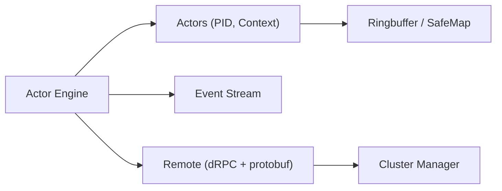

# anthdm/hollywood

> Moteur d'acteurs pour Go, conçu pour la faible latence : serveurs de jeu, courtiers publicitaires, moteurs de trading.

## Le problème
Construire des systèmes concurrents et distribués en Go sans gérer à la main verrous, canaux et supervision des pannes.

## Ce que ça fait vraiment
Un `Engine` crée des acteurs (`Spawn`), chacun identifié par un PID, avec une boîte de réception et un cycle de vie (Initialized, Started, Stopped). Redémarrage après panique, messagerie fire-and-forget ou requête-réponse, flux d'événements (dead letters), middleware, logs `slog`. Les acteurs distants passent par dRPC et protobuf, avec TLS ; un mode cluster gère la découverte. Compile aussi en WASM.

## Comment c'est branché


## Essayer
```bash
go get github.com/anthdm/hollywood/...
make bench
make test
```

## Coût et pièges
Gratuit. Go 1.21 minimum. Les messages qui traversent le réseau doivent être sérialisables en protobuf, donc passés par pointeur. Les événements non écoutés sont perdus : il faut abonner au moins un acteur aux `DeadLetterEvent`.

## Ce que ce n'est pas
Pas un framework de traitement de données. Les chiffres de débit (environ 3,5 millions de messages par seconde dans leur benchmark, « 10 millions en moins d'une seconde » en tête de README) viennent des auteurs. Le README ne cite qu'un usage en production : Sensora IoT et Market Monkey Terminal.

## Alternatives
Aucune alternative nommée dans le README.

## Pour toi
À ignorer : bibliothèque Go de concurrence, hors de ton champ data, IA ou MLOps, sauf si tu construis des services Go à faible latence.

