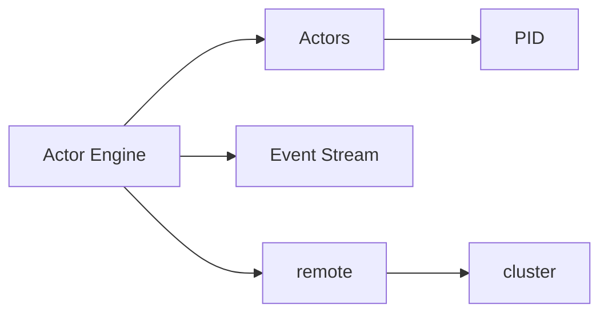

# anthdm/hollywood

> Moteur d'acteurs pour Go, pensé pour serveurs de jeu et systèmes à faible latence.

## Le problème
Écrire des systèmes très concurrents en Go avec état isolé, supervision et redémarrage sur panique demande beaucoup de plomberie.

## Ce que ce n'est pas
Voir plus bas ; d'abord ce que ça fait.

## Ce que ça fait vraiment
Un `Engine` fait naître des acteurs (`Spawn`) identifiés par un PID, qui reçoivent des messages via `Receive(ctx)`. Options : nombre max de redémarrages, taille de boîte aux lettres, middleware. Un event stream publie crashs, dead letters et cycle de vie. Le package `remote` transporte les messages en dRPC + protobuf (TLS possible), et `cluster` gère l'appartenance.

## Comment c'est branché


## Essayer
```bash
go get github.com/anthdm/hollywood/...
make bench
make test
```

## Coût et pièges
Gratuit. Go 1.21 requis. Les messages distants doivent être des pointeurs sérialisables en protobuf.

## Ce que ce n'est pas
Pas une plateforme de messagerie prête à l'emploi. Les chiffres de performance (10 M messages/s) viennent du README lui-même, sans tiers.

## Alternatives
Aucune alternative nommée dans le README.

## Pour toi
À ignorer : bibliothèque Go de concurrence sans lien avec données ou MLOps ; utile seulement si tu écris un serveur temps réel en Go.

