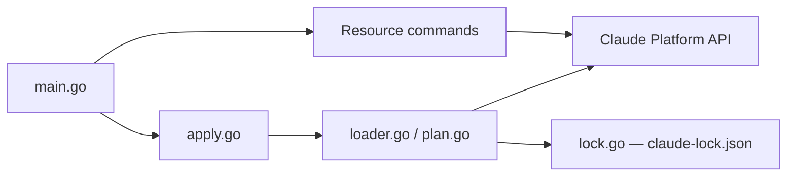

# anthropics/anthropic-cli

> CLI officielle `ant` de la Claude Platform : appeler l'API et gérer agents et ressources depuis le terminal.

## Le problème
Appeler l'API Claude, gérer agents, sessions et fichiers demande du code ou du curl, et les agents configurés dans la Console ne sont pas versionnés.

## Ce que ça fait vraiment
`ant <ressource> <commande>` couvre les endpoints de l'API (messages, modèles, agents bêta, sessions, fichiers). Les sorties se filtrent façon jq (`--transform`). `ant apply` synchronise agents, skills, environnements, vaults et déploiements depuis des fichiers du dépôt, avec un fichier `claude-lock.json`, un plan avant application et détection des modifications faites dans la Console.

## Comment c'est branché


## Essayer
```bash
brew install anthropics/tap/ant
ant auth login
ant models list
ant messages create \
  --model claude-opus-4-8 \
  --max-tokens 1024 \
  --message '{role: user, content: "Hello, Claude"}'
ant apply ./agents ./deployments ./environments ./skills
```

## Coût et pièges
Compte Claude Console ou clé `ANTHROPIC_API_KEY` : les appels sont facturés. Passer la clé via `--api-key` est déprécié ; préférer `--api-key-stdin`. `--prune` peut archiver une vault et détruire ses secrets.

## Ce que ce n'est pas
Pas un client de chat ni Claude Code. `ant apply` ne protège pas contre deux exécutions concurrentes (le README conseille de sérialiser en CI).

## Alternatives
Aucune alternative nommée dans le README.

## Pour toi
À adopter si tu utilises l'API Claude ou ses agents : c'est l'outil officiel et il rend la config d'agents relisible comme du code.

