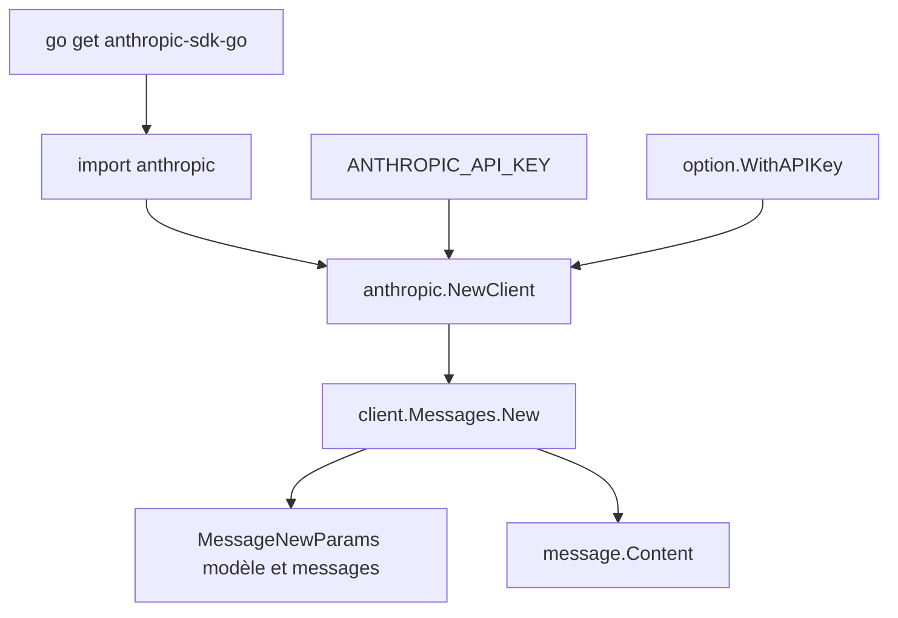

# anthropics/anthropic-sdk-go

> SDK Go officiel donnant accès à l'API Claude depuis une application Go.

## Le problème
Appeler l'API Claude en Go sans SDK impose d'écrire à la main la sérialisation, la gestion d'erreurs et le suivi des évolutions du schéma.
Chaque service Go réimplémente alors la même couche.

## Ce que ça fait vraiment
Fournit un client construit par `anthropic.NewClient`, la clé étant lue par défaut dans `ANTHROPIC_API_KEY` ou passée via `option.WithAPIKey`.
`client.Messages.New` prend un `MessageNewParams` avec `MaxTokens`, la liste de messages et le modèle, et renvoie le message et son contenu.
Des constructeurs typés (`NewUserMessage`, `NewTextBlock`) évitent de composer les structures à la main.
Les modèles sont exposés en constantes, par exemple `anthropic.ModelClaudeOpus4_6`.

## Comment c'est branché


## Essayer
```sh
go get -u 'github.com/anthropics/anthropic-sdk-go@v1.74.0'
```

## Coût et pièges
L'usage de l'API est facturé : la clé et la consommation restent à ta charge.
Go 1.24 minimum. La clé passée en clair dans le code, comme dans l'exemple du README, est à remplacer par la variable d'environnement.

## Ce que ce n'est pas
Pas un agent ni un framework : c'est un client d'API, la boucle d'outils et la logique applicative restent à écrire.
Pas une documentation complète : le README renvoie explicitement au site officiel pour tout le détail.
Pas un moyen d'exécuter un modèle en local.

## Alternatives
Aucune alternative nommée dans le README.

## Pour toi
Sans objet tant que ta chaîne est en Python ; le repère utile est la constante de modèle à jour pour vérifier une version.
