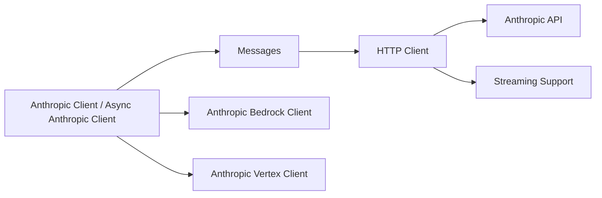

# anthropics/anthropic-sdk-python

> Bibliothèque Python officielle pour appeler l'API Claude depuis une application.

## Le problème
Appeler l'API Claude à la main (HTTP, authentification, streaming, erreurs) est répétitif ; le SDK l'emballe.

## Ce que ça fait vraiment
Le README est très court, à la limite du seuil de 800 caractères (fiche minimale). Il montre l'installation, un exemple `client.messages.create(...)` avec la clé lue dans `ANTHROPIC_API_KEY`, et l'exigence Python 3.10+. Il renvoie à la documentation en ligne et à un guide de migration depuis la série 0.x. D'après le code : clients `Anthropic` et `AsyncAnthropic`, variantes Bedrock et Vertex, ressources messages, modèles et lots bêta, sur httpx.

## Comment c'est branché


## Essayer
```bash
pip install anthropic
```
Puis créer un `Anthropic(...)` et appeler `client.messages.create(...)`, comme dans le README.

## Coût et pièges
Le SDK est gratuit, les appels sont facturés par Anthropic (clé d'API). La description d'architecture évoque Python 3.8+, le README exige 3.10+ : suivre le README. Une migration depuis 0.x demande de lire le guide.

## Ce que ce n'est pas
Ce n'est pas un cadre d'agents ni un orchestrateur : il donne un accès direct à l'API. La liste des fonctions, la gestion des erreurs, les nouveautés sont dans la documentation, pas dans le README.

## Alternatives
Aucune alternative nommée dans le README.

## Pour toi
À adopter : c'est le client officiel pour l'API Claude, sous licence MIT, maintenu (activité en septembre 2026) ; le README est mince, la documentation en ligne fait foi.
