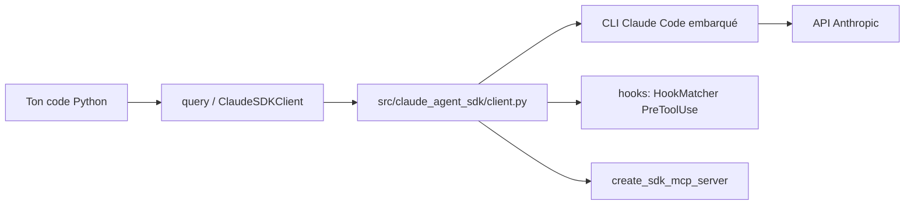

# anthropics/claude-agent-sdk-python

> SDK Python officiel pour piloter l'agent Claude Code depuis ton propre programme.

## Le problème
Appeler l'API de messages à la main oblige à réécrire la boucle d'agent : outils, permissions,
reprise de session, gestion d'erreurs. Le CLI Claude Code fait déjà tout ça, mais en terminal.

## Ce que ça fait vraiment
`query()` renvoie un itérateur asynchrone de messages pour un échange simple. `ClaudeSDKClient`
ouvre une conversation bidirectionnelle et débloque deux choses : les **outils personnalisés**,
déclarés par décorateur `@tool` et servis par un serveur MCP in-process (pas de sous-processus),
et les **hooks**, fonctions Python appelées par l'application à des points précis de la boucle,
capables de refuser un appel d'outil. Le CLI est embarqué dans le paquet.

## Comment c'est branché


## Essayer
```bash
pip install claude-agent-sdk
curl -fsSL https://claude.ai/install.sh | bash
./scripts/initial-setup.sh
python scripts/build_wheel.py --version 0.1.4
```

## Coût et pièges
Python 3.10+. Le SDK ne facture rien mais chaque tour consomme ton crédit Anthropic. Piège
documenté : `allowed_tools` est une liste de pré-approbation, pas un filtre — pour retirer un
outil il faut `disallowed_tools`. Le prompt système est figé au premier appel de la session sauf
`snapshot: False` (CLI ≥ 2.1.257).

## Ce que ce n'est pas
Ce n'est pas une API bas niveau : il passe par le CLI, pas directement par Messages. Ce n'est pas
compatible avec l'ancien Claude Code SDK — `ClaudeCodeOptions` devient `ClaudeAgentOptions`.

## Alternatives
Aucune alternative nommée dans le README.

## Pour toi
Le chemin court pour industrialiser un agent Claude en Python : à adopter si tu automatises des tâches outillées.
