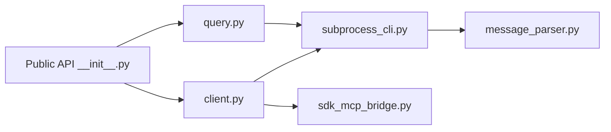

# anthropics/claude-code-sdk-python

> SDK Python pour piloter Claude Code par programme : requêtes, outils personnalisés et hooks.

## Le problème
Automatiser un agent de code depuis Python oblige à gérer soi-même le sous-processus CLI et le flux de messages.

## Ce que ça fait vraiment
`query()` renvoie un flux asynchrone de messages ; `ClaudeSDKClient` permet des échanges bidirectionnels, des outils personnalisés comme serveurs MCP dans le processus (`@tool`) et des hooks (par exemple `PreToolUse`). Le CLI Claude Code est embarqué dans le paquet. Gestion de sessions : liste, reprise, import, stockage configurable.

## Comment c'est branché


## Essayer
```bash
pip install claude-agent-sdk
```
```python
import anyio
from claude_agent_sdk import query

async def main():
    async for message in query(prompt="What is 2 + 2?"):
        print(message)

anyio.run(main)
```

## Coût et pièges
Python 3.10+. L'usage passe par Claude Code, donc authentification et consommation à ta charge. `allowed_tools` pré-approuve les outils sans les retirer.

## Ce que ce n'est pas
Ce n'est pas un client de l'API Messages : il pilote le CLI Claude Code. Il a été renommé depuis Claude Code SDK (`ClaudeCodeOptions` devient `ClaudeAgentOptions`).

## Alternatives
Non documenté : le README ne nomme pas d'alternative.

## Pour toi
Adopter si tu automatises des tâches de code avec des agents : SDK officiel, MIT, très actif ; accepte la dépendance au CLI.

