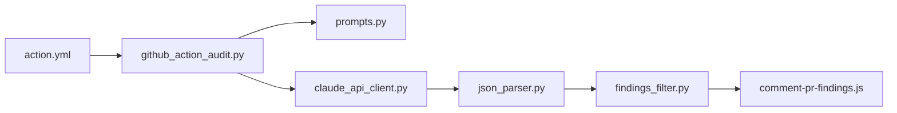

# anthropics/claude-code-security-review

> GitHub Action qui fait relire la sécurité de chaque pull request par Claude.

## Le problème
Les SAST classiques par motifs génèrent du bruit et ratent les failles de logique ; la relecture sécurité humaine de chaque PR ne passe pas à l'échelle.

## Ce que ça fait vraiment
Sur une PR, ne lit que les fichiers modifiés, construit un prompt d'audit et appelle Claude.
Parse la réponse JSON, filtre les faux positifs (DoS, rate limiting, redirections ouvertes exclus par défaut).
Commente les lignes concernées et dépose un fichier de résultats en artefact.
Fournit aussi un banc d'évaluation (`evals/`) et la commande `/security-review` pour Claude Code.

## Comment c'est branché


## Essayer
```bash
cd claude-code-security-review
pytest claudecode -v
```
L'usage réel se fait en ajoutant `anthropics/claude-code-security-review@main` dans `.github/workflows/security.yml`.

## Coût et pièges
Clé API Anthropic à ta charge, activée pour l'API et Claude Code ; modèle par défaut Opus 4.1, donc facture par PR.

## Ce que ce n'est pas
Pas protégé contre l'injection de prompt : à réserver aux PR de confiance. Ne remplace pas un audit complet, seulement le diff.

## Alternatives
Aucune alternative nommée dans le README.

## Pour toi
À surveiller : pratique pour un repo MLOps interne où les PR sont de confiance, mais coût par PR et risque d'injection interdisent de le brancher sur un repo public.
