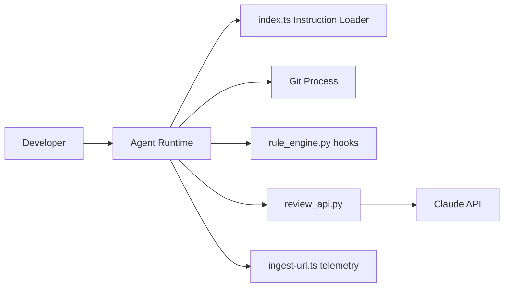

# anthropics/claude-code

> Agent de code d'Anthropic en terminal, IDE ou GitHub : lit le dépôt, modifie, gère git.

## Le problème
Les tâches de code répétitives (explorer un dépôt, corriger, commiter) se font à la main, fichier par fichier, sans outil qui comprend le projet dans son ensemble.

## Ce que ça fait vraiment
Tu décris la tâche en langage naturel ; l'agent charge les instructions du projet (`index.ts`), inspecte ou modifie le dépôt, lance git, puis rend un résultat ou une explication.
Le code échantillonné montre une inspection des diffs git, un moteur de règles pour les hooks (`rule_engine.py`), des plugins de revue de sécurité (`review_api.py`, `llm.py`) et une télémétrie de session (`ingest-url.ts`).
Le dépôt public contient surtout des plugins (commandes, agents) et sert de suivi des bugs ; l'orchestration centrale n'y est pas visible.

## Comment c'est branché


## Essayer
```bash
curl -fsSL https://claude.ai/install.sh | bash
brew install --cask claude-code
claude
```

## Coût et pièges
Le README ne donne ni tarif ni offre : il renvoie aux conditions commerciales d'Anthropic. L'installation npm est dépréciée.

## Ce que ce n'est pas
Ce n'est pas un outil open source : aucune licence déclarée, et le moteur de l'agent n'est pas dans le dépôt. Il collecte des données d'usage (acceptations, conversations associées, retours via `/bug`).

## Alternatives
Aucune alternative nommée dans le README.

## Pour toi
À adopter : c'est déjà ton outil ; le dossier `plugins` du dépôt sert d'exemples de hooks et d'agents.
