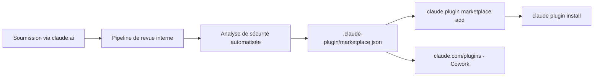

# anthropics/claude-plugins-community

> Miroir en lecture seule du catalogue de plugins communautaires installables dans Claude.

## Le problème
Trouver un plugin Claude fiable suppose de savoir lequel a été revu et approuvé.
Sans liste de référence, chacun installe au hasard depuis un dépôt inconnu.

## Ce que ça fait vraiment
Le fichier `.claude-plugin/marketplace.json` contient la liste des plugins communautaires installables.
Il est synchronisé chaque nuit depuis le pipeline de revue interne d'Anthropic.
Chaque plugin listé a été soumis via claude.ai, passé une analyse de sécurité automatisée, puis approuvé.
Les pull requests ouvertes directement contre le dépôt sont fermées automatiquement.

## Comment c'est branché


## Essayer
```bash
claude plugin marketplace add anthropics/claude-plugins-community
claude plugin install <plugin-name>@claude-community
```

## Coût et pièges
Gratuit. Le dépôt est un miroir : toute contribution passe par le formulaire de soumission, pas par une PR.
« Approuvé » veut dire passé une analyse automatisée, pas audité ligne à ligne.

## Ce que ce n'est pas
Pas les plugins maintenus par Anthropic — ceux-là sont dans `anthropics/claude-plugins-official`.
Pas un dépôt de code : il ne contient que le manifeste du catalogue.
Pas un lieu de discussion ni de revue publique.

## Alternatives
`anthropics/claude-plugins-official` : les plugins maintenus par Anthropic.
`anthropics/knowledge-work-plugins` : les plugins orientés métiers non techniques.

## Pour toi
Le bon point d'entrée pour piocher un plugin sans fouiller GitHub ; à mettre dans tes signets.
