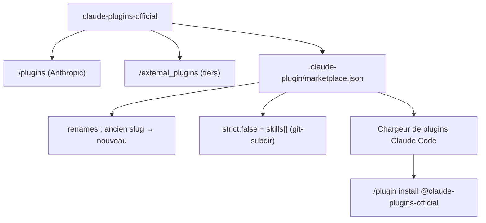

# anthropics/claude-plugins-official

> Annuaire de plugins Claude Code, séparant plugins internes Anthropic et plugins tiers.

## Le problème
Installer un plugin inconnu revient à exécuter du code et des serveurs MCP non vérifiés ; sans
annuaire, rien ne distingue une contribution relue d'un dépôt improvisé.

## Ce que ça fait vraiment
Sépare deux dossiers : `/plugins` pour les plugins développés et maintenus par Anthropic,
`/external_plugins` pour ceux de partenaires et de la communauté, soumis via un formulaire et
soumis à des critères de qualité et de sécurité.
Fixe la structure attendue d'un plugin : `.claude-plugin/plugin.json` obligatoire, puis `.mcp.json`,
`commands/`, `agents/`, `skills/` et un README, tous optionnels.
Pose une règle dure : le champ `name` est un identifiant immuable — le changer casse les
installations existantes ; l'affichage se modifie via `displayName`, et un renommage inévitable
passe par la table `renames` de `marketplace.json`, que le chargeur applique à la synchronisation
suivante. Décrit aussi les plugins-paquets de skills, déclarés en `strict: false`.

## Comment c'est branché


## Essayer
```bash
/plugin install {plugin-name}@claude-plugins-official
```

## Coût et pièges
Gratuit. L'avertissement est explicite dans le README : Anthropic ne contrôle pas les serveurs MCP,
fichiers ou logiciels embarqués dans un plugin, ne peut pas garantir qu'ils fonctionnent comme
prévu ni qu'ils ne changeront pas — la confiance reste ton problème, page d'accueil de chaque
plugin à l'appui.

## Ce que ce n'est pas
Ce n'est pas une garantie de sécurité, malgré le nom « official » : la présence dans
`/external_plugins` ne vaut pas audit. Ce n'est pas un catalogue lisible : le README décrit la
mécanique, pas la liste des plugins. Ce n'est pas un outil, c'est un dépôt de métadonnées.

## Alternatives
Aucune alternative nommée dans le README.

## Pour toi
Le point de départ raisonnable avant d'aller chercher des plugins dans des marketplaces tierces.
