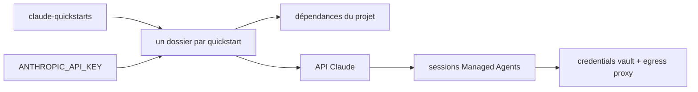

# anthropics/claude-quickstarts

> Collection de projets de départ pour construire des applications sur l'API Claude.

## Le problème
Partir d'une page blanche sur une API d'agents coûte des jours avant le premier résultat utile.
Les patrons qui marchent (cache de prompt, compaction, outils groupés) ne s'inventent pas.

## Ce que ça fait vraiment
Chaque quickstart est un projet autonome avec son README et ses instructions d'installation.
Couvre analyse de données financières, usage d'ordinateur (conteneurisé et natif macOS), automatisation de navigateur via Playwright.
Un agent de codage autonome sur le Claude Agent SDK, avec pattern à deux agents et progression persistée par git.
Huit exemples Managed Agents : Chat SDK, CopilotKit/AG-UI, wiki de connaissances, Linear, serveur MCP, planificateur, Sentry.

## Comment c'est branché

## Essayer
Pas de bloc de commandes dans ce README : il décrit cinq étapes — cloner le dépôt, entrer dans le dossier
du quickstart, installer les dépendances, poser la clé d'API en variable d'environnement, lancer l'application.

## Coût et pièges
Une clé d'API Claude est nécessaire, et chaque exécution est facturée à l'usage.
Le quickstart « Computer Use Best Practices » tourne directement sur le bureau macOS : le README dit de l'exécuter dans une VM.

## Ce que ce n'est pas
Pas une bibliothèque : rien à installer globalement, ce sont des bases de code à reprendre et modifier.
Pas un produit supporté : ce sont des fondations à personnaliser selon ton besoin.
Pas exhaustif sur l'API : le README renvoie à la documentation, aux cookbooks et au cours Fundamentals.

## Alternatives
`Claude Cookbooks` — extraits de code et guides pour des tâches courantes, cités comme ressource complémentaire.

## Pour toi
La bonne porte d'entrée pour un patron précis (MCP, computer use, wiki de connaissances) plutôt qu'un tutoriel linéaire.
