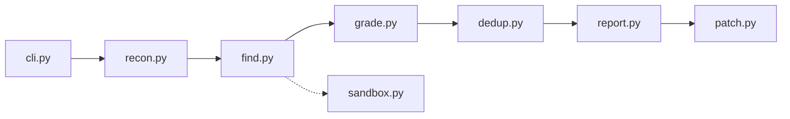

# anthropics/defending-code-reference-harness

> Pipeline de référence où Claude cherche, vérifie et corrige des failles de sécurité ; pour équipes sécurité.

## Le problème
Trouver des vulnérabilités dans du code demande du temps d'expert, et les résultats automatiques noient l'équipe sous les faux positifs.

## Ce que ça fait vraiment
Fournit des skills Claude Code (`/quickstart`, `/threat-model`, `/vuln-scan`, `/triage`, `/patch`) et un pipeline autonome recon → find → verify → dedupe → report → patch. La cible de référence est du C/C++ compilé avec ASAN dans Docker. Un second volet (`/dnr-hunt`, `/dnr-respond`) cherche un attaquant dans des logs. Le README précise que le dépôt n'est ni maintenu ni ouvert aux contributions.

## Comment c'est branché


## Essayer
```bash
git clone https://github.com/anthropics/defending-code-reference-harness
cd defending-code-reference-harness
claude
> /quickstart
python3 -m venv .venv && .venv/bin/pip install -e .
./scripts/setup_sandbox.sh
bin/vp-sandboxed run drlibs --model <model-id> --runs 3 --parallel --stream --auto-focus
```

## Coût et pièges
Les agents consomment des appels API à ta charge ; les pipelines exécutent du code cible et refusent de tourner hors d'un sandbox gVisor (Docker requis). Le README prévient que le triage et le patch autonomes restent des points ouverts.

## Ce que ce n'est pas
Pas un produit : le README dit « reference, not a product » et ne fonctionne pas sur n'importe quelle base de code sans `/customize`. Pas maintenu.

## Alternatives
- Claude Security : option hébergée et gérée, citée dans le README.

## Pour toi
À surveiller comme modèle d'architecture d'agents (sandbox, vérification indépendante), plus que comme outil à déployer : non maintenu et licence à clarifier.

