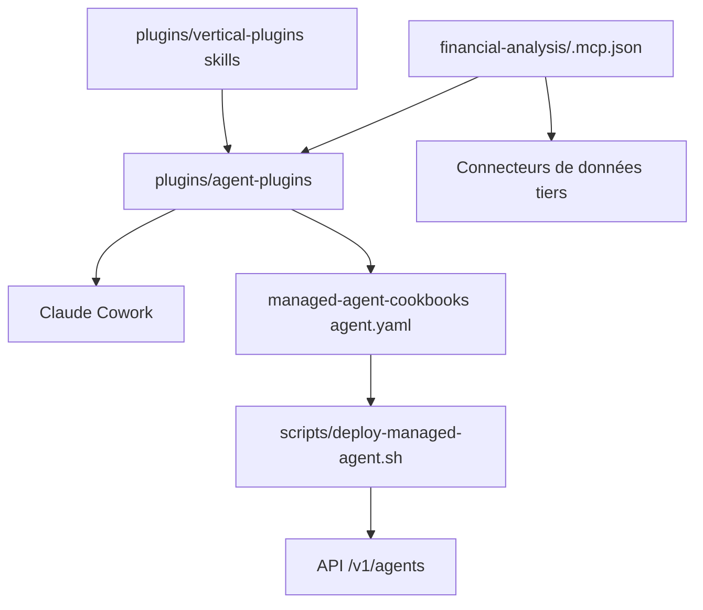

# anthropics/financial-services

> Agents, skills et connecteurs de référence pour les métiers de la finance, côté Claude.

## Le problème
Les workflows d'analyste financier (comps, DCF, LBO, rapprochement de grand livre, KYC) se refont à la main dans chaque cabinet.
Rien ne relie l'assistant aux terminaux de données et aux gabarits Excel/PowerPoint existants.

## Ce que ça fait vraiment
Fournit des agents nommés par workflow — Pitch Agent, Market Researcher, Earnings Reviewer, GL Reconciler, KYC Screener… — chacun autonome, embarquant ses propres skills.
Chaque agent existe en deux formes depuis la même source : plugin Claude Cowork, ou template déployé via l'API Claude Managed Agents (`/v1/agents`).
Des plugins verticaux (investment-banking, equity-research, private-equity, fund-admin, operations) regroupent skills, commandes slash (`/comps`, `/dcf`, `/earnings`, `/ic-memo`) et connecteurs MCP.
Onze connecteurs MCP centralisés dans le plugin `financial-analysis` : Daloopa, Morningstar, S&P Global, FactSet, Moody's, LSEG, PitchBook, Box, Egnyte, etc. Tout est fichiers markdown et JSON, sans étape de build.

## Comment c'est branché


## Essayer
```bash
claude plugin marketplace add anthropics/financial-services
claude plugin install financial-analysis@claude-for-financial-services
claude plugin install pitch-agent@claude-for-financial-services
export ANTHROPIC_API_KEY=sk-ant-...
scripts/deploy-managed-agent.sh gl-reconciler
```

## Coût et pièges
Les connecteurs MCP exigent souvent un abonnement ou une clé chez le fournisseur (FactSet, PitchBook, Moody's…) : la vraie facture est là.
La délégation à des sous-agents (`callable_agents`) est en aperçu de recherche ; consulter les notes de sécurité par agent.

## Ce que ce n'est pas
Ce n'est pas un conseil en investissement : le README insiste, les agents rédigent des livrables d'analyste destinés à validation humaine, ils n'exécutent ni transaction ni écriture comptable.
Ce ne sont pas des produits finis : ce sont des gabarits à adapter aux processus et à la terminologie de la maison.
Ce n'est pas indépendant de l'écosystème Claude.

## Alternatives
Aucune alternative n'est nommée dans le README.

## Pour toi
Utile surtout comme modèle d'architecture : la structure skills / agents / connecteurs se reprend hors finance.
