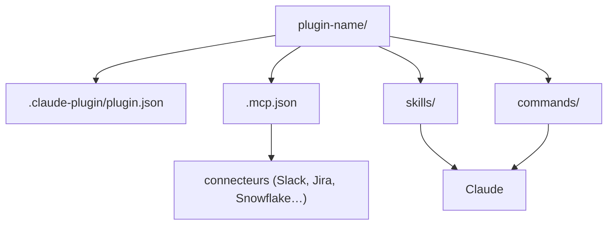

# anthropics/knowledge-work-plugins

> Onze plugins métier pour Claude Cowork et Claude Code, à adapter au vocabulaire de son entreprise.

## Le problème
Un assistant générique ignore les outils, le vocabulaire et les procédures d'une équipe : chaque
demande recommence par dix lignes de contexte que l'on retape.

## Ce que ça fait vraiment
Chaque plugin regroupe des skills (expertise métier, déclenchée automatiquement), des commandes
slash explicites (`/sales:call-prep`, `/data:write-query`, `/finance:reconciliation`) et un
`.mcp.json` qui branche les connecteurs. Onze domaines : productivity, sales, customer-support,
product-management, marketing, legal, finance, data, enterprise-search, bio-research et
cowork-plugin-management. Tout est en markdown et JSON — aucun code, aucun build.

## Comment c'est branché


## Essayer
```bash
claude plugin marketplace add anthropics/knowledge-work-plugins
claude plugin install sales@knowledge-work-plugins
```

## Coût et pièges
Le plugin `data` suppose Snowflake, Databricks ou BigQuery ; `finance` aussi. Chaque connecteur est
un service tiers avec son propre compte et sa propre facture. Le README présente les plugins comme
des points de départ génériques : l'utilité réelle vient du travail de personnalisation.

## Ce que ce n'est pas
Pas des outils autonomes : ils n'existent que dans Cowork ou Claude Code. Pas une intégration
clé en main — sans réécriture des skills avec ton vocabulaire, ils restent au niveau du manuel.
Pas de code exécutable : ce sont des fichiers de contexte, pas des programmes.

## Alternatives
- `cowork-plugin-management` : le plugin du dépôt prévu pour en fabriquer d'autres.

## Pour toi
Le plugin `data` mérite une lecture comme modèle de structuration de skills, même sans l'installer.
