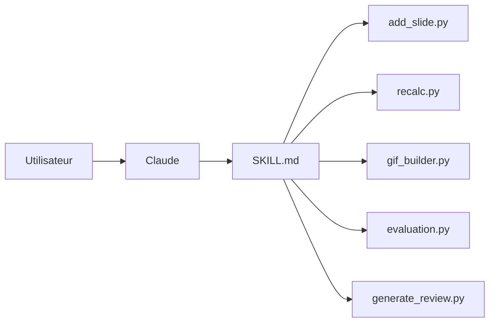

# anthropics/skills

> Skills de référence d'Anthropic pour Claude (documents, design, MCP, tests), à installer ou copier.

## Le problème
Faire suivre à un agent une procédure répétable (remplir un PDF, éditer un pptx, créer une skill) sans tout réexpliquer dans chaque prompt.

## Ce que ça fait vraiment
Chaque skill est un dossier autonome avec un `SKILL.md` (front matter `name` + `description`, puis des instructions) et parfois des scripts : `add_slide.py` (pptx), `recalc.py` (formules xlsx), `gif_builder.py` (GIF Slack), `evaluation.py` (serveurs MCP), `generate_review.py` (revue d'évaluation de skills).
Le dépôt contient aussi la spécification Agent Skills (`./spec`) et un gabarit (`./template`).
Il s'installe comme marketplace de plugins Claude Code, en deux lots : `document-skills` et `example-skills`.

## Comment c'est branché


## Essayer
```bash
# commandes à taper dans Claude Code
/plugin marketplace add anthropics/skills
/plugin install document-skills@anthropic-agent-skills
/plugin install example-skills@anthropic-agent-skills
```

## Coût et pièges
Les fichiers sont lisibles librement, mais s'en servir suppose Claude : offre payante sur Claude.ai, ou API. Aucune licence au niveau du dépôt ; docx/pdf/pptx/xlsx sont « source-available », pas open source.

## Ce que ce n'est pas
Le README prévient : démonstration et pédagogie, pas une garantie du comportement de Claude en production. Les skills de documents ne sont pas réutilisables librement malgré leur présence publique.

## Alternatives
- Notion Skills for Claude — citées comme skills partenaires, pour Notion.

## Pour toi
À adopter comme modèle : lire `skill-creator` et les skills de documents avant d'écrire les tiennes.
