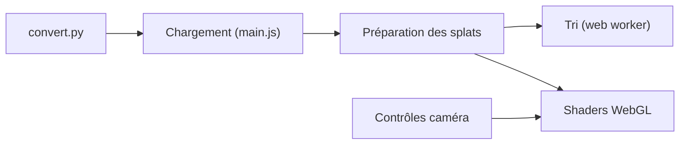

# antimatter15/splat

> Visualiseur WebGL temps réel de scènes 3D Gaussian Splatting, sans dépendance, avec convertisseur PLY vers SPLAT.

## Le problème
Les scènes de Gaussian Splatting sont produites en PLY et peu faciles à afficher dans un navigateur.

## Ce que ça fait vraiment
Charge un fichier `.splat` (ou convertit un `.ply` déposé), trie les splats par taille et opacité dans un web worker sur CPU, puis les rend avec des shaders WebGL 1.0. Contrôles clavier, souris et tactile, vues enregistrables dans l'URL, chargement par paramètre `url`. N'affiche pas les effets dépendant de la vue (harmoniques sphériques).

## Comment c'est branché

## Essayer
Aucune commande documentée. Démo en ligne : https://antimatter15.com/splat/?url=garden.splat

## Coût et pièges
Gratuit. Les fichiers hébergés doivent être accessibles en CORS. Tri à ~4 images par seconde, avec artefacts lors de sauts de caméra.

## Ce que ce n'est pas
Pas un outil d'entraînement : visualisation seule. Le README renvoie vers Spark pour un rendu plus avancé sous THREE.js.

## Alternatives
Spark (rendu 3DGS dynamique pour THREE.js, cité dans le README).

## Pour toi
Pratique pour montrer un résultat de reconstruction 3D dans un navigateur ; dépôt à jour de novembre 2025 : surveiller.

