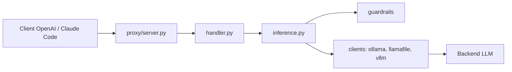

# antoinezambelli/forge

> Couche de fiabilité pour l'appel d'outils des LLM auto-hébergés : validation, réparation et relance.

## Le problème
Les petits modèles locaux appellent mal les outils : format cassé, outil inconnu, étapes sautées.

## Ce que ça fait vraiment
Trois usages : proxy compatible OpenAI et Anthropic (`/v1/messages`), `WorkflowRunner` pour une boucle d'agent gérée, ou middleware de garde-fous. Le proxy valide chaque appel d'outil, extrait les appels mal formatés (rescue parsing), relance avec un message correctif jusqu'à `--max-retries` (3 par défaut). Backends : llama-server, Ollama, Llamafile, vLLM, Anthropic. Le README annonce 84 % sur sa suite de 26 scénarios pour un modèle 8B (mesure de l'auteur).

## Comment c'est branché


## Essayer
```bash
pip install forge-guardrails
llama-server -m path/to/Ministral-3-8B-Instruct-2512-Q8_0.gguf --jinja -ngl 999 --port 8080
python -m forge.proxy --backend-url http://localhost:8080 --backend llamaserver --port 8081
```

## Coût et pièges
Python 3.12+ et un backend LLM local (GPU utile). Le proxy n'authentifie pas les appelants ; il ne compacte pas l'historique et n'applique pas l'ordre des étapes.

## Ce que ce n'est pas
Pas un orchestrateur multi-agents ni un harnais de code : il fiabilise une seule boucle d'outils.

## Alternatives
- opencode, aider, Cline : clients que le proxy renforce, pas des concurrents.

## Pour toi
Adopter si tu fais tourner des modèles locaux avec des outils : le proxy s'intercale sans réécrire ton client.
