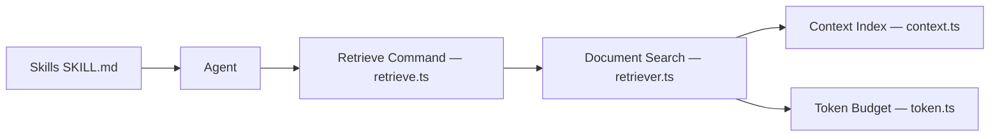

# antvis/chart-visualization-skills

> Skills d'agents pour générer des graphiques AntV (G2, G6, X6), avec un service de recherche de documentation.

## Le problème
Les LLM génèrent souvent du code G2 ou G6 obsolète (API v4 au lieu de v5) et hallucinent des options.

## Ce que ça fait vraiment
Le dépôt fournit des skills (G2 v5, G6 v5, X6 v3, GPT-Vis, infographies, narratifs T8, recherche d'icônes) installables comme plugin Claude Code ou via `npx skills`. Il expose aussi une recherche de contexte (hybride FTS + vecteurs) sur les docs G2/G6/X6, via API HTTP hébergée, CLI `antv` et API JS. Le README cite une évaluation sur 174 cas, avec des gains par rapport à Context7 (non vérifiés ici).

## Comment c'est branché


## Essayer
```bash
/plugin marketplace add antvis/chart-visualization-skills
npx skills add antvis/chart-visualization-skills
npm install -g @antv/chart-visualization-skills
antv retrieve "bar chart" --library g2 --topk 10
```

## Coût et pièges
Gratuit. Le service HTTP public (`sive.antv.antgroup.com`) est un tiers ; la CLI permet une récupération locale. Le projet ne fusionne que du code généré par IA.

## Ce que ce n'est pas
Pas une bibliothèque de graphiques : il s'appuie sur AntV. Ce n'est pas Python/matplotlib.

## Alternatives
Context7 : référence de comparaison du README, moins précis selon leurs mesures.

## Pour toi
À surveiller : utile si tu génères des graphiques web avec un agent, moins si ton flux est en Python.

