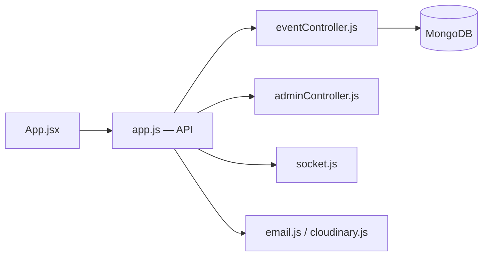

# anubhavxdev/Event-management-system-main

> Application web full-stack de gestion d'événements avec billets PDF à QR code et enregistrement en temps réel.

## Le problème
Organisateurs et participants ont besoin d'un outil pour publier, s'inscrire, contrôler les entrées et noter des événements.

## Ce que ça fait vraiment
Une API Express/MongoDB avec JWT et Socket.IO, et un front React/Vite/Tailwind, avec trois rôles : client (inscription, billet PDF avec QR, avis), organisateur (participants, export CSV, check-in temps réel) et administrateur (modération, statistiques). Le code envoie des e-mails et stocke les affiches sur Cloudinary.

## Comment c'est branché


## Essayer
```bash
cd backend && npm install
cd ../frontend && npm install
cd ../backend
npm run dev
node src/seed.js
```
(Fichier `backend/.env` à créer avec `PORT`, `MONGODB_URI`, `JWT_SECRET`, `CLIENT_ORIGIN`.)

## Coût et pièges
MongoDB nécessaire. Comptes de démo aux mots de passe triviaux (`password`) et secret JWT d'exemple : à changer avant tout déploiement. 153 issues ouvertes pour 69 étoiles.

## Ce que ce n'est pas
Pas « production-ready » malgré l'affirmation du README : projet d'étude. Sans lien avec la data ou l'IA.

## Alternatives
Aucune alternative nommée dans le README.

## Pour toi
À ignorer : application web générique hors de ton domaine, sans composant data ou IA, et les mots de passe de démo montrent un niveau de sécurité d'exemple.

