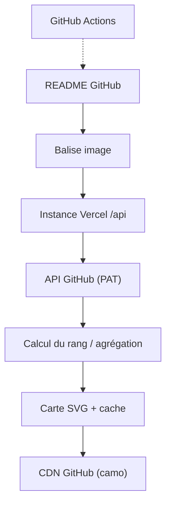

# anuraghazra/github-readme-stats

> Service qui génère des cartes SVG de statistiques GitHub à coller dans un README.

## Le problème
Un profil GitHub n'affiche pas de résumé chiffré, ni plus de six dépôts épinglés.
Produire ces visuels à la main et les tenir à jour est impossible.

## Ce que ça fait vraiment
Une URL d'API renvoie une carte SVG : statistiques générales, langages les plus utilisés, dépôt épinglé, gist, WakaTime.
Paramétrable par query string : thème, couleurs, masquage de métriques, largeur, rayon, locale, durée de cache.
Le rang (S à C) est calculé comme une somme pondérée de percentiles, implémentée dans `src/calculateRank.js`.
Cinq mises en page pour la carte de langages : normal, compact, donut, donut vertical, camembert.

## Comment c'est branché


## Essayer
```md
[](https://github.com/anuraghazra/github-readme-stats)
```

## Coût et pièges
Gratuit. L'instance publique est « best-effort » et tombe sous les limites de débit — l'auto-hébergement est recommandé.
Les statistiques privées exigent d'héberger sa propre instance avec un jeton personnel GitHub.

## Ce que ce n'est pas
**Le dépôt n'est plus maintenu** : le README renvoie vers GitHub Stats Extended, un fork actif.
Pas une mesure de compétence : la carte de langages mesure des octets de code dans tes dépôts non forkés.
Limité aux 100 premiers dépôts, et ignore tes contributions chez les autres.

## Alternatives
- GitHub Stats Extended : le fork maintenu, désigné comme successeur par le README.
- GitHub Readme Stats Action : génération dans ton propre dépôt de profil.

## Pour toi
Archivé, et sans intérêt technique pour un profil data/IA. À ignorer.
