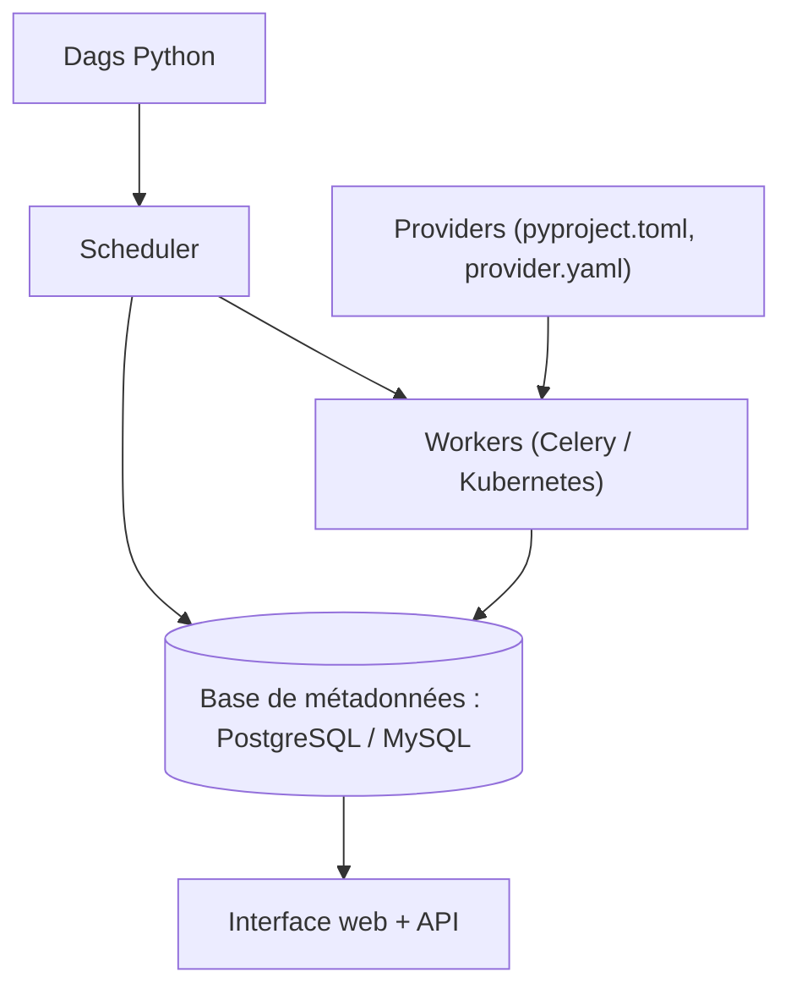

# apache/airflow

> Ordonnanceur de workflows définis en Python, pour équipes data et ML en production.

## Le problème
Sans lui, les chaînes de traitement vivent dans des crontabs et des scripts : dépendances
implicites, reprise manuelle après échec, aucune visibilité sur ce qui tourne.

## Ce que ça fait vraiment
Fait écrire des Dags en Python ; un scheduler exécute les tâches sur un parc de workers en
respectant les dépendances déclarées. L'interface montre Dags, Assets, vue Grid, vue Graph,
backfill sur une plage de dates et le code source d'un Dag.
Le README assume l'opinion : tâches idempotentes, pas de gros volumes passés de tâche en tâche
(XCom ne sert qu'aux métadonnées), délégation du calcul lourd à des services spécialisés.

## Comment c'est branché


## Essayer
```bash
pip install 'apache-airflow==3.3.0' \
 --constraint "https://raw.githubusercontent.com/apache/airflow/constraints-3.3.0/constraints-3.10.txt"
pip install 'apache-airflow[postgres,google]==3.3.0' \
 --constraint "https://raw.githubusercontent.com/apache/airflow/constraints-3.3.0/constraints-3.10.txt"
```

## Coût et pièges
Gratuit (Apache 2.0). Le fichier de contraintes n'est pas optionnel : `pip install apache-airflow`
seul « ne marchera pas de temps en temps ». Seuls pip et uv sont supportés, ni Poetry ni pip-tools.
SQLite est interdit en production ; Windows n'est pas supporté, seulement WSL2 ou conteneurs.

## Ce que ce n'est pas
Ce n'est pas une solution de streaming : il traite le temps réel par lots tirés des flux.
Ce n'est pas fait pour des Dags dont la structure change à chaque exécution. Ce n'est pas un agent :
sur les charges LLM il orchestre les étapes, il ne raisonne pas.

## Alternatives
- **Luigi** : projet similaire cité par le README, plus léger.
- **Oozie** : ordonnanceur de l'écosystème Hadoop.
- **Azkaban** : autre ordonnanceur de batchs cité comme comparable.

## Pour toi
Le socle par défaut si tu dois réentraîner, évaluer et déployer des modèles sur un calendrier.
