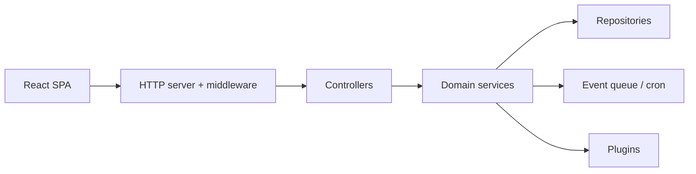

# apache/answer

> Plateforme de questions-réponses auto-hébergée, pour forums communautaires, centres d'aide et bases de connaissances.

## Le problème
Un forum ou une base de connaissances interne exige d'assembler questions, réponses, votes, modération et notifications.

## Ce que ça fait vraiment
Un serveur Go avec interface React : questions, réponses, commentaires, tags, révisions, revues, votes, badges, notifications. Un système de plugins couvre authentification, CAPTCHA, stockage, recherche (dont vectorielle), notifications. D'après le code : conversations IA, embeddings et routes MCP, file d'événements interne et tâches cron.

## Comment c'est branché


## Essayer
```bash
docker run -d -p 9080:80 -v answer-data:/data --name answer apache/answer:2.0.2
make generate
make ui
make build
```

## Coût et pièges
Compilation : Go 1.23+, Node 20+, pnpm 9+, mockgen et wire. Le volume `/data` doit persister. 137 issues ouvertes.

## Ce que ce n'est pas
Ce n'est pas un outil de recherche sur documents : c'est un forum de type Q&R. L'IA et le MCP sont décrits par le code, pas par le README.

## Alternatives
Aucune alternative nommée dans le README.

## Pour toi
À surveiller : une base de Q&R interne pour une équipe data, sous gouvernance Apache, avec une porte d'entrée MCP intéressante à tester.

